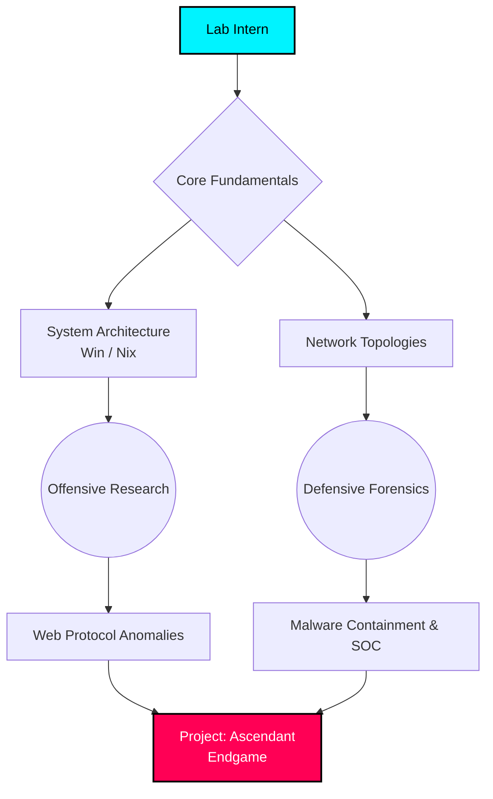

  

  

  

  

---

> [!IMPORTANT]
> **SYSTEM INITIALIZATION: HIDDEN EYE LABS**
> Welcome to the Hidden Eye Cyber Research Institute. This repository contains the highly classified PROJECT: SYNAPSE matrix—a compilation of 660 isolated network anomalies (TryHackMe rooms). Your directive is to dissect these anomalies, study their infection vectors, and synthesize countermeasures. Progression through this matrix will elevate your clearance from *Lab Intern* to *Lead Research Director*.[^1]

### 🔬 Comm-Link Established...
> *"The data stream never lies. We dissect the anomalies, isolate the malware, and listen to the pulse of the network. Put on your lab coat, researcher—we have work to do."* — **Dr. Shirayuki, Lead Threat Analyst**

### 📊 Research Workflow Topology

## 🗄️ Research Archives (Arcs)
<ul>
<li><a href="#arc-01-prologue-the-awakening">ARC 01: PROLOGUE: THE AWAKENING</a> (21 anomalies)</li>
<li><a href="#arc-02-forbidden-kernel">ARC 02: FORBIDDEN KERNEL</a> (54 anomalies)</li>
<li><a href="#arc-03-wired-protocols">ARC 03: WIRED PROTOCOLS</a> (37 anomalies)</li>
<li><a href="#arc-04-shadow-recon-&-osint">ARC 04: SHADOW RECON & OSINT</a> (32 anomalies)</li>
<li><a href="#arc-05-web-exploitation-grind">ARC 05: WEB EXPLOITATION GRIND</a> (56 anomalies)</li>
<li><a href="#arc-06-keymaster-vault">ARC 06: KEYMASTER VAULT</a> (23 anomalies)</li>
<li><a href="#arc-07-root-escalation-linux">ARC 07: ROOT ESCALATION: LINUX</a> (21 anomalies)</li>
<li><a href="#arc-08-domain-overlord">ARC 08: DOMAIN OVERLORD</a> (51 anomalies)</li>
<li><a href="#arc-09-nebula-cloud-&-docker">ARC 09: NEBULA CLOUD & DOCKER</a> (28 anomalies)</li>
<li><a href="#arc-10-blue-ghost-investigation">ARC 10: BLUE GHOST INVESTIGATION</a> (33 anomalies)</li>
<li><a href="#arc-11-code-breakers-&-malware-lab">ARC 11: CODE BREAKERS & MALWARE LAB</a> (36 anomalies)</li>
<li><a href="#arc-12-rookie-arena-easy-ctfs">ARC 12: ROOKIE ARENA: EASY CTFs</a> (115 anomalies)</li>
<li><a href="#arc-13-elite-gauntlet-medium-ctfs">ARC 13: ELITE GAUNTLET: MEDIUM CTFs</a> (103 anomalies)</li>
<li><a href="#arc-14-endgame-hard-&-insane-boss-raids">ARC 14: ENDGAME: HARD & INSANE BOSS RAIDS</a> (38 anomalies)</li>
<li><a href="#bonus-arc-secret-weapons-&-reinforcements">BONUS ARC: SECRET WEAPONS & REINFORCEMENTS</a> (12 anomalies)</li>
</ul>

---

## 🧪 ARC 01: PROLOGUE: THE AWAKENING

<b>📋 Access Lab Notes</b>

> [!TIP]
> **Research Protocol:** Ensure your secure VPN tunnel is active (`sudo openvpn hidden_eye.ovpn`) before interacting with the containment environment. Log all findings meticulously in your research journal.

| Containment | ID | Anomaly Designation | Methodology | Threat Tier | Classification | Uplink |
| :---: | :---: | :--- | :---: | :---: | :--- | :--- |
| - [ ] | 001 | **[Win Prizes and Learn - 2023!](https://tryhackme.com/room/tickets4)** | 🔬 Guided Analysis | 🔵 Theory | ``Miscellaneous`` | [🧬 Inject](https://tryhackme.com/room/tickets4) |
| - [ ] | 002 | **[Learn & win prizes - Fall 2022](https://tryhackme.com/room/tickets3)** | 🔬 Guided Analysis | 🔵 Theory | ``Miscellaneous`` | [🧬 Inject](https://tryhackme.com/room/tickets3) |
| - [ ] | 003 | **[Careers in Cyber](https://tryhackme.com/room/careersincyber)** | 🔬 Guided Analysis | 🔵 Theory | ``Miscellaneous`` | [🧬 Inject](https://tryhackme.com/room/careersincyber) |
| - [ ] | 004 | **[Security Awareness](https://tryhackme.com/room/securityawarenessintro)** | 🔬 Guided Analysis | 🔵 Theory | ``Miscellaneous`` | [🧬 Inject](https://tryhackme.com/room/securityawarenessintro) |
| - [ ] | 005 | **[Learn and win prizes #2](https://tryhackme.com/room/tickets2)** | 🔬 Guided Analysis | 🔵 Theory | ``Miscellaneous`` | [🧬 Inject](https://tryhackme.com/room/tickets2) |
| - [ ] | 006 | **[Learn and win prizes](https://tryhackme.com/room/tickets1)** | 🔬 Guided Analysis | 🔵 Theory | ``Miscellaneous`` | [🧬 Inject](https://tryhackme.com/room/tickets1) |
| - [ ] | 007 | **[Advent of Cyber 2023](https://tryhackme.com/room/adventofcyber2023)** | 🔬 Guided Analysis | 🟢 Level 1 | ``Miscellaneous`` | [🧬 Inject](https://tryhackme.com/room/adventofcyber2023) |
| - [ ] | 008 | **[Become a Hacker](https://tryhackme.com/room/becomeahackeroa)** | 🔬 Guided Analysis | 🟢 Level 1 | ``Miscellaneous`` | [🧬 Inject](https://tryhackme.com/room/becomeahackeroa) |
| - [ ] | 009 | **[Advent of Cyber 2022](https://tryhackme.com/room/adventofcyber4)** | 🔬 Guided Analysis | 🟢 Level 1 | ``Miscellaneous`` | [🧬 Inject](https://tryhackme.com/room/adventofcyber4) |
| - [ ] | 010 | **[Advent of Cyber 3 (2021)](https://tryhackme.com/room/adventofcyber3)** | 🔬 Guided Analysis | 🟢 Level 1 | ``Miscellaneous`` | [🧬 Inject](https://tryhackme.com/room/adventofcyber3) |
| - [ ] | 011 | **[Learning Cyber Security](https://tryhackme.com/room/beginnerpathintro)** | 🔬 Guided Analysis | 🟢 Level 1 | ``Miscellaneous`` | [🧬 Inject](https://tryhackme.com/room/beginnerpathintro) |
| - [ ] | 012 | **[How to use TryHackMe](https://tryhackme.com/room/howtousetryhackme)** | 🔬 Guided Analysis | 🟢 Level 1 | ``Miscellaneous`` | [🧬 Inject](https://tryhackme.com/room/howtousetryhackme) |
| - [ ] | 013 | **[25 Days of Cyber Security](https://tryhackme.com/room/learncyberin25days)** | 🔬 Guided Analysis | 🟢 Level 1 | ``Miscellaneous`` | [🧬 Inject](https://tryhackme.com/room/learncyberin25days) |
| - [ ] | 014 | **[Advent of Cyber 2 [2020](https://tryhackme.com/room/adventofcyber2)** | 🔬 Guided Analysis | 🟢 Level 1 | ``Miscellaneous`` | [🧬 Inject](https://tryhackme.com/room/adventofcyber2) |
| - [ ] | 015 | **[Getting Started](https://tryhackme.com/room/gettingstarted)** | 🔬 Guided Analysis | 🟢 Level 1 | ``OSINT`` | [🧬 Inject](https://tryhackme.com/room/gettingstarted) |
| - [ ] | 016 | **[Starting Out In Cyber Sec](https://tryhackme.com/room/startingoutincybersec)** | 🔬 Guided Analysis | 🟢 Level 1 | ``Miscellaneous`` | [🧬 Inject](https://tryhackme.com/room/startingoutincybersec) |
| - [ ] | 017 | **[Tutorial](https://tryhackme.com/room/tutorial)** | 🔬 Guided Analysis | 🟢 Level 1 | ``Miscellaneous`` | [🧬 Inject](https://tryhackme.com/room/tutorial) |
| - [ ] | 018 | **[Welcome](https://tryhackme.com/room/hello)** | 🔬 Guided Analysis | 🟢 Level 1 | ``Miscellaneous`` | [🧬 Inject](https://tryhackme.com/room/hello) |
| - [ ] | 019 | **[Advent of Cyber 1 [2019](https://tryhackme.com/room/25daysofchristmas)** | 🔬 Guided Analysis | 🟢 Level 1 | ``Miscellaneous`` | [🧬 Inject](https://tryhackme.com/room/25daysofchristmas) |
| - [ ] | 020 | **[Adventofcyber2024](https://tryhackme.com/room/adventofcyber2024)** | ⚠️ Blind Trial | ⚪ Unknown | ``General CTF`` | [🧬 Inject](https://tryhackme.com/room/adventofcyber2024) |
| - [ ] | 021 | **[Welcome](https://tryhackme.com/room/welcome)** | ⚠️ Blind Trial | ⚪ Unknown | ``General CTF`` | [🧬 Inject](https://tryhackme.com/room/welcome) |

[⬆️ Return to Archives](#-research-archives-arcs)

---

## 🧪 ARC 02: FORBIDDEN KERNEL

<b>📋 Access Lab Notes</b>

> [!TIP]
> **Research Protocol:** Ensure your secure VPN tunnel is active (`sudo openvpn hidden_eye.ovpn`) before interacting with the containment environment. Log all findings meticulously in your research journal.

| Containment | ID | Anomaly Designation | Methodology | Threat Tier | Classification | Uplink |
| :---: | :---: | :--- | :---: | :---: | :--- | :--- |
| - [ ] | 022 | **[Spring4Shell: CVE-2022-22965](https://tryhackme.com/room/spring4shell)** | 🔬 Guided Analysis | 🔵 Theory | ``Linux`` | [🧬 Inject](https://tryhackme.com/room/spring4shell) |
| - [ ] | 023 | **[Dirty Pipe: CVE-2022-0847](https://tryhackme.com/room/dirtypipe)** | 🔬 Guided Analysis | 🔵 Theory | ``Linux`` | [🧬 Inject](https://tryhackme.com/room/dirtypipe) |
| - [ ] | 024 | **[Windows Fundamentals 3](https://tryhackme.com/room/windowsfundamentals3xzx)** | 🔬 Guided Analysis | 🔵 Theory | ``Windows`` | [🧬 Inject](https://tryhackme.com/room/windowsfundamentals3xzx) |
| - [ ] | 025 | **[Windows Fundamentals 2](https://tryhackme.com/room/windowsfundamentals2x0x)** | 🔬 Guided Analysis | 🔵 Theory | ``Windows`` | [🧬 Inject](https://tryhackme.com/room/windowsfundamentals2x0x) |
| - [ ] | 026 | **[Linux Fundamentals Part 1](https://tryhackme.com/room/linuxfundamentalspart1)** | 🔬 Guided Analysis | 🔵 Theory | ``Linux`` | [🧬 Inject](https://tryhackme.com/room/linuxfundamentalspart1) |
| - [ ] | 027 | **[OverlayFS - CVE-2021-3493](https://tryhackme.com/room/overlayfs)** | 🔬 Guided Analysis | 🔵 Theory | ``Linux`` | [🧬 Inject](https://tryhackme.com/room/overlayfs) |
| - [ ] | 028 | **[REmux The Tmux](https://tryhackme.com/room/tmuxremux)** | 🔬 Guided Analysis | 🔵 Theory | ``Miscellaneous`` | [🧬 Inject](https://tryhackme.com/room/tmuxremux) |
| - [ ] | 029 | **[Windows Incident Surface](https://tryhackme.com/room/winincidentsurface)** | 🔬 Guided Analysis | 🟢 Level 1 | ``Windows`` | [🧬 Inject](https://tryhackme.com/room/winincidentsurface) |
| - [ ] | 030 | **[Linux Process Analysis](https://tryhackme.com/room/linuxprocessanalysis)** | 🔬 Guided Analysis | 🟢 Level 1 | ``Linux`` | [🧬 Inject](https://tryhackme.com/room/linuxprocessanalysis) |
| - [ ] | 031 | **[Linux File System Analysis](https://tryhackme.com/room/linuxfilesystemanalysis)** | 🔬 Guided Analysis | 🟢 Level 1 | ``Linux`` | [🧬 Inject](https://tryhackme.com/room/linuxfilesystemanalysis) |
| - [ ] | 032 | **[Bulletproof Penguin](https://tryhackme.com/room/bppenguin)** | 🔬 Guided Analysis | 🟢 Level 1 | ``Linux`` | [🧬 Inject](https://tryhackme.com/room/bppenguin) |
| - [ ] | 033 | **[Registry Persistence Detection](https://tryhackme.com/room/registrypersistencedetection)** | 🔬 Guided Analysis | 🟢 Level 1 | ``Windows`` | [🧬 Inject](https://tryhackme.com/room/registrypersistencedetection) |
| - [ ] | 034 | **[x86 Architecture Overview](https://tryhackme.com/room/x8664arch)** | 🔬 Guided Analysis | 🟢 Level 1 | ``Reverse Engineering`` | [🧬 Inject](https://tryhackme.com/room/x8664arch) |
| - [ ] | 035 | **[Introduction to Windows API](https://tryhackme.com/room/windowsapi)** | 🔬 Guided Analysis | 🟢 Level 1 | ``Windows`` | [🧬 Inject](https://tryhackme.com/room/windowsapi) |
| - [ ] | 036 | **[Atlas](https://tryhackme.com/room/atlas)** | 🔬 Guided Analysis | 🟢 Level 1 | ``Windows`` | [🧬 Inject](https://tryhackme.com/room/atlas) |
| - [ ] | 037 | **[Python Basics](https://tryhackme.com/room/pythonbasics)** | 🔬 Guided Analysis | 🟢 Level 1 | ``Web`` | [🧬 Inject](https://tryhackme.com/room/pythonbasics) |
| - [ ] | 038 | **[Linux Backdoors](https://tryhackme.com/room/linuxbackdoors)** | 🔬 Guided Analysis | 🟢 Level 1 | ``Linux`` | [🧬 Inject](https://tryhackme.com/room/linuxbackdoors) |
| - [ ] | 039 | **[Linux Modules](https://tryhackme.com/room/linuxmodules)** | 🔬 Guided Analysis | 🟢 Level 1 | ``Linux`` | [🧬 Inject](https://tryhackme.com/room/linuxmodules) |
| - [ ] | 040 | **[Bash Scripting](https://tryhackme.com/room/bashscripting)** | 🔬 Guided Analysis | 🟢 Level 1 | ``Linux`` | [🧬 Inject](https://tryhackme.com/room/bashscripting) |
| - [ ] | 041 | **[Linux Strength Training](https://tryhackme.com/room/linuxstrengthtraining)** | 🔬 Guided Analysis | 🟢 Level 1 | ``Linux`` | [🧬 Inject](https://tryhackme.com/room/linuxstrengthtraining) |
| - [ ] | 042 | **[Physical Security Intro](https://tryhackme.com/room/physicalsecurityintro)** | 🔬 Guided Analysis | 🟢 Level 1 | ``Miscellaneous`` | [🧬 Inject](https://tryhackme.com/room/physicalsecurityintro) |
| - [ ] | 043 | **[Learn Rust](https://tryhackme.com/room/rust)** | 🔬 Guided Analysis | 🟢 Level 1 | ``Miscellaneous`` | [🧬 Inject](https://tryhackme.com/room/rust) |
| - [ ] | 044 | **[Kenobi](https://tryhackme.com/room/kenobi)** | 🔬 Guided Analysis | 🟢 Level 1 | ``Windows`` | [🧬 Inject](https://tryhackme.com/room/kenobi) |
| - [ ] | 045 | **[The Cod Caper](https://tryhackme.com/room/thecodcaper)** | 🔬 Guided Analysis | 🟢 Level 1 | ``Linux`` | [🧬 Inject](https://tryhackme.com/room/thecodcaper) |
| - [ ] | 046 | **[tmux](https://tryhackme.com/room/rptmux)** | 🔬 Guided Analysis | 🟢 Level 1 | ``Linux`` | [🧬 Inject](https://tryhackme.com/room/rptmux) |
| - [ ] | 047 | **[Ice](https://tryhackme.com/room/ice)** | 🔬 Guided Analysis | 🟢 Level 1 | ``Windows`` | [🧬 Inject](https://tryhackme.com/room/ice) |
| - [ ] | 048 | **[Blue](https://tryhackme.com/room/blue)** | 🔬 Guided Analysis | 🟢 Level 1 | ``Windows`` | [🧬 Inject](https://tryhackme.com/room/blue) |
| - [ ] | 049 | **[Toolbox: Vim](https://tryhackme.com/room/toolboxvim)** | 🔬 Guided Analysis | 🟢 Level 1 | ``Cryptography`` | [🧬 Inject](https://tryhackme.com/room/toolboxvim) |
| - [ ] | 050 | **[CVE-2023-38408](https://tryhackme.com/room/cve202338408)** | 🔬 Guided Analysis | 🟡 Level 2 | ``Linux`` | [🧬 Inject](https://tryhackme.com/room/cve202338408) |
| - [ ] | 051 | **[Unattended](https://tryhackme.com/room/unattended)** | 🔬 Guided Analysis | 🟡 Level 2 | ``Windows`` | [🧬 Inject](https://tryhackme.com/room/unattended) |
| - [ ] | 052 | **[LocalPotato](https://tryhackme.com/room/localpotato)** | 🔬 Guided Analysis | 🟡 Level 2 | ``Windows`` | [🧬 Inject](https://tryhackme.com/room/localpotato) |
| - [ ] | 053 | **[Tardigrade](https://tryhackme.com/room/tardigrade)** | 🔬 Guided Analysis | 🟡 Level 2 | ``Linux`` | [🧬 Inject](https://tryhackme.com/room/tardigrade) |
| - [ ] | 054 | **[Bypassing UAC](https://tryhackme.com/room/bypassinguac)** | 🔬 Guided Analysis | 🟡 Level 2 | ``Windows`` | [🧬 Inject](https://tryhackme.com/room/bypassinguac) |
| - [ ] | 055 | **[Windows Forensics 1](https://tryhackme.com/room/windowsforensics1)** | 🔬 Guided Analysis | 🟡 Level 2 | ``Windows`` | [🧬 Inject](https://tryhackme.com/room/windowsforensics1) |
| - [ ] | 056 | **[Windows Reversing Intro](https://tryhackme.com/room/windowsreversingintro)** | 🔬 Guided Analysis | 🟡 Level 2 | ``Windows`` | [🧬 Inject](https://tryhackme.com/room/windowsreversingintro) |
| - [ ] | 057 | **[Windows x64 Assembly](https://tryhackme.com/room/win64assembly)** | 🔬 Guided Analysis | 🟡 Level 2 | ``Windows`` | [🧬 Inject](https://tryhackme.com/room/win64assembly) |
| - [ ] | 058 | **[Linux Function Hooking](https://tryhackme.com/room/linuxfunctionhooking)** | 🔬 Guided Analysis | 🟡 Level 2 | ``Linux`` | [🧬 Inject](https://tryhackme.com/room/linuxfunctionhooking) |
| - [ ] | 059 | **[Windows PrivEsc](https://tryhackme.com/room/windows10privesc)** | 🔬 Guided Analysis | 🟡 Level 2 | ``Windows`` | [🧬 Inject](https://tryhackme.com/room/windows10privesc) |
| - [ ] | 060 | **[Windows PrivEsc Arena](https://tryhackme.com/room/windowsprivescarena)** | 🔬 Guided Analysis | 🟡 Level 2 | ``Windows`` | [🧬 Inject](https://tryhackme.com/room/windowsprivescarena) |
| - [ ] | 061 | **[PrintNightmare, again!](https://tryhackme.com/room/printnightmarec2bn7l)** | ⚠️ Blind Trial | 🟢 Level 1 | ``Windows`` | [🧬 Inject](https://tryhackme.com/room/printnightmarec2bn7l) |
| - [ ] | 062 | **[Anthem](https://tryhackme.com/room/anthem)** | ⚠️ Blind Trial | 🟢 Level 1 | ``Windows`` | [🧬 Inject](https://tryhackme.com/room/anthem) |
| - [ ] | 063 | **[LazyAdmin](https://tryhackme.com/room/lazyadmin)** | ⚠️ Blind Trial | 🟢 Level 1 | ``Linux`` | [🧬 Inject](https://tryhackme.com/room/lazyadmin) |
| - [ ] | 064 | **[Blueprint](https://tryhackme.com/room/blueprint)** | ⚠️ Blind Trial | 🟢 Level 1 | ``Windows`` | [🧬 Inject](https://tryhackme.com/room/blueprint) |
| - [ ] | 065 | **[Ninja Skills](https://tryhackme.com/room/ninjaskills)** | ⚠️ Blind Trial | 🟢 Level 1 | ``Linux`` | [🧬 Inject](https://tryhackme.com/room/ninjaskills) |
| - [ ] | 066 | **[Investigating Windows](https://tryhackme.com/room/investigatingwindows)** | ⚠️ Blind Trial | 🟢 Level 1 | ``Windows`` | [🧬 Inject](https://tryhackme.com/room/investigatingwindows) |
| - [ ] | 067 | **[Stealth](https://tryhackme.com/room/stealth)** | ⚠️ Blind Trial | 🟡 Level 2 | ``Windows`` | [🧬 Inject](https://tryhackme.com/room/stealth) |
| - [ ] | 068 | **[PrintNightmare, thrice!](https://tryhackme.com/room/printnightmarec3kj)** | ⚠️ Blind Trial | 🟡 Level 2 | ``Windows`` | [🧬 Inject](https://tryhackme.com/room/printnightmarec3kj) |
| - [ ] | 069 | **[Investigating Windows 2.0](https://tryhackme.com/room/investigatingwindows2)** | ⚠️ Blind Trial | 🟡 Level 2 | ``Windows`` | [🧬 Inject](https://tryhackme.com/room/investigatingwindows2) |
| - [ ] | 070 | **[Investigating Windows 3.x](https://tryhackme.com/room/investigatingwindows3)** | ⚠️ Blind Trial | 🟡 Level 2 | ``Windows`` | [🧬 Inject](https://tryhackme.com/room/investigatingwindows3) |
| - [ ] | 071 | **[0day](https://tryhackme.com/room/0day)** | ⚠️ Blind Trial | 🟡 Level 2 | ``Linux`` | [🧬 Inject](https://tryhackme.com/room/0day) |
| - [ ] | 072 | **[Brainpan 1](https://tryhackme.com/room/brainpan)** | ⚠️ Blind Trial | 🔴 Level 3 | ``Windows`` | [🧬 Inject](https://tryhackme.com/room/brainpan) |
| - [ ] | 073 | **[Introtox8664](https://tryhackme.com/room/introtox8664)** | ⚠️ Blind Trial | ⚪ Unknown | ``General CTF`` | [🧬 Inject](https://tryhackme.com/room/introtox8664) |
| - [ ] | 074 | **[Thefindcommand](https://tryhackme.com/room/thefindcommand)** | ⚠️ Blind Trial | ⚪ Unknown | ``General CTF`` | [🧬 Inject](https://tryhackme.com/room/thefindcommand) |
| - [ ] | 075 | **[Linux2](https://tryhackme.com/room/linux2)** | ⚠️ Blind Trial | ⚪ Unknown | ``General CTF`` | [🧬 Inject](https://tryhackme.com/room/linux2) |

[⬆️ Return to Archives](#-research-archives-arcs)

---

## 🧪 ARC 03: WIRED PROTOCOLS

<b>📋 Access Lab Notes</b>

> [!TIP]
> **Research Protocol:** Ensure your secure VPN tunnel is active (`sudo openvpn hidden_eye.ovpn`) before interacting with the containment environment. Log all findings meticulously in your research journal.

| Containment | ID  | Anomaly Designation                                                                       |    Methodology     | Threat Tier | Classification    | Uplink                                                              |
| :---------: | :-: | :---------------------------------------------------------------------------------------- | :----------------: | :---------: | :---------------- | :------------------------------------------------------------------ |
|    - [ ]    | 076 | **[What is Networking?](https://tryhackme.com/room/whatisnetworking)**                    | 🔬 Guided Analysis |  🔵 Theory  | ``Networking``    | [🧬 Inject](https://tryhackme.com/room/whatisnetworking)            |
|    - [ ]    | 077 | **[HTTP Request Smuggling](https://tryhackme.com/room/httprequestsmuggling)**             | 🔬 Guided Analysis | 🟢 Level 1  | ``Networking``    | [🧬 Inject](https://tryhackme.com/room/httprequestsmuggling)        |
|    - [ ]    | 078 | **[Probe](https://tryhackme.com/room/probe)**                                             | 🔬 Guided Analysis | 🟢 Level 1  | ``Networking``    | [🧬 Inject](https://tryhackme.com/room/probe)                       |
|    - [ ]    | 079 | **[Traffic Analysis Essentials](https://tryhackme.com/room/trafficanalysisessentials)**   | 🔬 Guided Analysis | 🟢 Level 1  | ``Networking``    | [🧬 Inject](https://tryhackme.com/room/trafficanalysisessentials)   |
|    - [ ]    | 080 | **[L2 MAC Flooding & ARP Spoofing](https://tryhackme.com/room/layer2)**                   | 🔬 Guided Analysis | 🟢 Level 1  | ``Networking``    | [🧬 Inject](https://tryhackme.com/room/layer2)                      |
|    - [ ]    | 081 | **[HTTP in Detail](https://tryhackme.com/room/httpindetail)**                             | 🔬 Guided Analysis | 🟢 Level 1  | ``Networking``    | [🧬 Inject](https://tryhackme.com/room/httpindetail)                |
|    - [ ]    | 082 | **[DNS in detail](https://tryhackme.com/room/dnsindetail)**                               | 🔬 Guided Analysis | 🟢 Level 1  | ``Networking``    | [🧬 Inject](https://tryhackme.com/room/dnsindetail)                 |
|    - [ ]    | 083 | **[OpenVAS](https://tryhackme.com/room/openvas)**                                         | 🔬 Guided Analysis | 🟢 Level 1  | ``Networking``    | [🧬 Inject](https://tryhackme.com/room/openvas)                     |
|    - [ ]    | 084 | **[RustScan](https://tryhackme.com/room/rustscan)**                                       | 🔬 Guided Analysis | 🟢 Level 1  | ``Miscellaneous`` | [🧬 Inject](https://tryhackme.com/room/rustscan)                    |
|    - [ ]    | 085 | **[Nmap](https://tryhackme.com/room/furthernmap)**                                        | 🔬 Guided Analysis | 🟢 Level 1  | ``Networking``    | [🧬 Inject](https://tryhackme.com/room/furthernmap)                 |
|    - [ ]    | 086 | **[Attacking ICS Plant #1](https://tryhackme.com/room/attackingics1)**                    | 🔬 Guided Analysis | 🟢 Level 1  | ``Networking``    | [🧬 Inject](https://tryhackme.com/room/attackingics1)               |
|    - [ ]    | 087 | **[Network Services 2](https://tryhackme.com/room/networkservices2)**                     | 🔬 Guided Analysis | 🟢 Level 1  | ``Networking``    | [🧬 Inject](https://tryhackme.com/room/networkservices2)            |
|    - [ ]    | 088 | **[Network Services](https://tryhackme.com/room/networkservices)**                        | 🔬 Guided Analysis | 🟢 Level 1  | ``Networking``    | [🧬 Inject](https://tryhackme.com/room/networkservices)             |
|    - [ ]    | 089 | **[Introductory Networking](https://tryhackme.com/room/introtonetworking)**               | 🔬 Guided Analysis | 🟢 Level 1  | ``Networking``    | [🧬 Inject](https://tryhackme.com/room/introtonetworking)           |
|    - [ ]    | 090 | **[Hydra](https://tryhackme.com/room/hydra)**                                             | 🔬 Guided Analysis | 🟢 Level 1  | ``Networking``    | [🧬 Inject](https://tryhackme.com/room/hydra)                       |
|    - [ ]    | 091 | **[Tor](https://tryhackme.com/room/torforbeginners)**                                     | 🔬 Guided Analysis | 🟢 Level 1  | ``Networking``    | [🧬 Inject](https://tryhackme.com/room/torforbeginners)             |
|    - [ ]    | 092 | **[OpenVPN](https://tryhackme.com/room/openvpn)**                                         | 🔬 Guided Analysis | 🟢 Level 1  | ``Networking``    | [🧬 Inject](https://tryhackme.com/room/openvpn)                     |
|    - [ ]    | 093 | **[Wifi Hacking 101](https://tryhackme.com/room/wifihacking101)**                         | 🔬 Guided Analysis | 🟢 Level 1  | ``Wireless``      | [🧬 Inject](https://tryhackme.com/room/wifihacking101)              |
|    - [ ]    | 094 | **[Secure Network Architecture](https://tryhackme.com/room/introtosecurityarchitecture)** | 🔬 Guided Analysis | 🟡 Level 2  | ``Networking``    | [🧬 Inject](https://tryhackme.com/room/introtosecurityarchitecture) |
|    - [ ]    | 095 | **[Intrusion Detection](https://tryhackme.com/room/idsevasion)**                          | 🔬 Guided Analysis | 🟡 Level 2  | ``Networking``    | [🧬 Inject](https://tryhackme.com/room/idsevasion)                  |
|    - [ ]    | 096 | **[Snort](https://tryhackme.com/room/snort)**                                             | 🔬 Guided Analysis | 🟡 Level 2  | ``Networking``    | [🧬 Inject](https://tryhackme.com/room/snort)                       |
|    - [ ]    | 097 | **[Nmap Live Host Discovery](https://tryhackme.com/room/nmap01)**                         | 🔬 Guided Analysis | 🟡 Level 2  | ``Networking``    | [🧬 Inject](https://tryhackme.com/room/nmap01)                      |
|    - [ ]    | 098 | **[TShark](https://tryhackme.com/room/tshark)**                                           | 🔬 Guided Analysis | 🟡 Level 2  | ``Forensics``     | [🧬 Inject](https://tryhackme.com/room/tshark)                      |
|    - [ ]    | 099 | **[HTTP/2 Request Smuggling](https://tryhackme.com/room/http2requestsmuggling)**          | 🔬 Guided Analysis | 🔴 Level 3  | ``Networking``    | [🧬 Inject](https://tryhackme.com/room/http2requestsmuggling)       |
|    - [ ]    | 100 | **[Intermediate Nmap](https://tryhackme.com/room/intermediatenmap)**                      |   ⚠️ Blind Trial   | 🟢 Level 1  | ``Networking``    | [🧬 Inject](https://tryhackme.com/room/intermediatenmap)            |
|    - [ ]    | 101 | **[Dig Dug](https://tryhackme.com/room/digdug)**                                          |   ⚠️ Blind Trial   | 🟢 Level 1  | ``Networking``    | [🧬 Inject](https://tryhackme.com/room/digdug)                      |
|    - [ ]    | 102 | **[VulnNet: Roasted](https://tryhackme.com/room/vulnnetroasted)**                         |   ⚠️ Blind Trial   | 🟢 Level 1  | ``Networking``    | [🧬 Inject](https://tryhackme.com/room/vulnnetroasted)              |
|    - [ ]    | 103 | **[Easy Peasy](https://tryhackme.com/room/easypeasyctf)**                                 |   ⚠️ Blind Trial   | 🟢 Level 1  | ``Networking``    | [🧬 Inject](https://tryhackme.com/room/easypeasyctf)                |
|    - [ ]    | 104 | **[Warzone 2](https://tryhackme.com/room/warzonetwo)**                                    |   ⚠️ Blind Trial   | 🟡 Level 2  | ``Networking``    | [🧬 Inject](https://tryhackme.com/room/warzonetwo)                  |
|    - [ ]    | 105 | **[Warzone 1](https://tryhackme.com/room/warzoneone)**                                    |   ⚠️ Blind Trial   | 🟡 Level 2  | ``Networking``    | [🧬 Inject](https://tryhackme.com/room/warzoneone)                  |
|    - [ ]    | 106 | **[Snort Challenge - Live Attacks](https://tryhackme.com/room/snortchallenges2)**         |   ⚠️ Blind Trial   | 🟡 Level 2  | ``Networking``    | [🧬 Inject](https://tryhackme.com/room/snortchallenges2)            |
|    - [ ]    | 107 | **[Unstable Twin](https://tryhackme.com/room/unstabletwin)**                              |   ⚠️ Blind Trial   | 🟡 Level 2  | ``Networking``    | [🧬 Inject](https://tryhackme.com/room/unstabletwin)                |
|    - [ ]    | 108 | **[Attacking ICS Plant #2](https://tryhackme.com/room/attackingics2)**                    |   ⚠️ Blind Trial   | 🟡 Level 2  | ``Networking``    | [🧬 Inject](https://tryhackme.com/room/attackingics2)               |
|    - [ ]    | 109 | **[Nax](https://tryhackme.com/room/nax)**                                                 |   ⚠️ Blind Trial   | 🟡 Level 2  | ``Networking``    | [🧬 Inject](https://tryhackme.com/room/nax)                         |
|    - [ ]    | 110 | **[For Business Reasons](https://tryhackme.com/room/forbusinessreasons)**                 |   ⚠️ Blind Trial   | 🔴 Level 3  | ``Networking``    | [🧬 Inject](https://tryhackme.com/room/forbusinessreasons)          |
|    - [ ]    | 111 | **[Borderlands](https://tryhackme.com/room/borderlands)**                                 |   ⚠️ Blind Trial   | 🔴 Level 3  | ``Networking``    | [🧬 Inject](https://tryhackme.com/room/borderlands)                 |
|    - [ ]    | 112 | **[Bpnetworking](https://tryhackme.com/room/bpnetworking)**                               |   ⚠️ Blind Trial   |  ⚪ Unknown  | ``General CTF``   | [🧬 Inject](https://tryhackme.com/room/bpnetworking)                |

[⬆️ Return to Archives](#-research-archives-arcs)

---

## 🧪 ARC 04: SHADOW RECON & OSINT

<b>📋 Access Lab Notes</b>

> [!TIP]
> **Research Protocol:** Ensure your secure VPN tunnel is active (`sudo openvpn hidden_eye.ovpn`) before interacting with the containment environment. Log all findings meticulously in your research journal.

| Containment | ID | Anomaly Designation | Methodology | Threat Tier | Classification | Uplink |
| :---: | :---: | :--- | :---: | :---: | :--- | :--- |
| - [ ] | 113 | **[Security Principles](https://tryhackme.com/room/securityprinciples)** | 🔬 Guided Analysis | 🟢 Level 1 | ``Miscellaneous`` | [🧬 Inject](https://tryhackme.com/room/securityprinciples) |
| - [ ] | 114 | **[Unified Kill Chain](https://tryhackme.com/room/unifiedkillchain)** | 🔬 Guided Analysis | 🟢 Level 1 | ``Miscellaneous`` | [🧬 Inject](https://tryhackme.com/room/unifiedkillchain) |
| - [ ] | 115 | **[Cyber Kill Chain](https://tryhackme.com/room/cyberkillchainzmt)** | 🔬 Guided Analysis | 🟢 Level 1 | ``Cryptography`` | [🧬 Inject](https://tryhackme.com/room/cyberkillchainzmt) |
| - [ ] | 116 | **[Threat Intelligence Tools](https://tryhackme.com/room/threatinteltools)** | 🔬 Guided Analysis | 🟢 Level 1 | ``OSINT`` | [🧬 Inject](https://tryhackme.com/room/threatinteltools) |
| - [ ] | 117 | **[Intro to Defensive Security](https://tryhackme.com/room/defensivesecurity)** | 🔬 Guided Analysis | 🟢 Level 1 | ``Miscellaneous`` | [🧬 Inject](https://tryhackme.com/room/defensivesecurity) |
| - [ ] | 118 | **[Intro to Offensive Security](https://tryhackme.com/room/introtooffensivesecurity)** | 🔬 Guided Analysis | 🟢 Level 1 | ``Web`` | [🧬 Inject](https://tryhackme.com/room/introtooffensivesecurity) |
| - [ ] | 119 | **[Red Team Engagements](https://tryhackme.com/room/redteamengagements)** | 🔬 Guided Analysis | 🟢 Level 1 | ``Miscellaneous`` | [🧬 Inject](https://tryhackme.com/room/redteamengagements) |
| - [ ] | 120 | **[Red Team Fundamentals](https://tryhackme.com/room/redteamfundamentals)** | 🔬 Guided Analysis | 🟢 Level 1 | ``Miscellaneous`` | [🧬 Inject](https://tryhackme.com/room/redteamfundamentals) |
| - [ ] | 121 | **[Common Attacks](https://tryhackme.com/room/commonattacks)** | 🔬 Guided Analysis | 🟢 Level 1 | ``Miscellaneous`` | [🧬 Inject](https://tryhackme.com/room/commonattacks) |
| - [ ] | 122 | **[Active Reconnaissance](https://tryhackme.com/room/activerecon)** | 🔬 Guided Analysis | 🟢 Level 1 | ``OSINT`` | [🧬 Inject](https://tryhackme.com/room/activerecon) |
| - [ ] | 123 | **[Passive Reconnaissance](https://tryhackme.com/room/passiverecon)** | 🔬 Guided Analysis | 🟢 Level 1 | ``OSINT`` | [🧬 Inject](https://tryhackme.com/room/passiverecon) |
| - [ ] | 124 | **[Vulnerabilities 101](https://tryhackme.com/room/vulnerabilities101)** | 🔬 Guided Analysis | 🟢 Level 1 | ``Cloud`` | [🧬 Inject](https://tryhackme.com/room/vulnerabilities101) |
| - [ ] | 125 | **[Pentesting Fundamentals](https://tryhackme.com/room/pentestingfundamentals)** | 🔬 Guided Analysis | 🟢 Level 1 | ``Miscellaneous`` | [🧬 Inject](https://tryhackme.com/room/pentestingfundamentals) |
| - [ ] | 126 | **[The Hacker Methodology](https://tryhackme.com/room/hackermethodology)** | 🔬 Guided Analysis | 🟢 Level 1 | ``Miscellaneous`` | [🧬 Inject](https://tryhackme.com/room/hackermethodology) |
| - [ ] | 127 | **[AttackerKB](https://tryhackme.com/room/attackerkb)** | 🔬 Guided Analysis | 🟢 Level 1 | ``Miscellaneous`` | [🧬 Inject](https://tryhackme.com/room/attackerkb) |
| - [ ] | 128 | **[Google Dorking](https://tryhackme.com/room/googledorking)** | 🔬 Guided Analysis | 🟢 Level 1 | ``Miscellaneous`` | [🧬 Inject](https://tryhackme.com/room/googledorking) |
| - [ ] | 129 | **[Introductory Researching](https://tryhackme.com/room/introtoresearch)** | 🔬 Guided Analysis | 🟢 Level 1 | ``Miscellaneous`` | [🧬 Inject](https://tryhackme.com/room/introtoresearch) |
| - [ ] | 130 | **[Vulnversity](https://tryhackme.com/room/vulnversity)** | 🔬 Guided Analysis | 🟢 Level 1 | ``OSINT`` | [🧬 Inject](https://tryhackme.com/room/vulnversity) |
| - [ ] | 131 | **[Geolocating Images](https://tryhackme.com/room/geolocatingimages)** | 🔬 Guided Analysis | 🟢 Level 1 | ``Miscellaneous`` | [🧬 Inject](https://tryhackme.com/room/geolocatingimages) |
| - [ ] | 132 | **[Shodan.io](https://tryhackme.com/room/shodan)** | 🔬 Guided Analysis | 🟢 Level 1 | ``Miscellaneous`` | [🧬 Inject](https://tryhackme.com/room/shodan) |
| - [ ] | 133 | **[Threat Intelligence for SOC](https://tryhackme.com/room/threatintelligenceforsoc)** | 🔬 Guided Analysis | 🟡 Level 2 | ``Miscellaneous`` | [🧬 Inject](https://tryhackme.com/room/threatintelligenceforsoc) |
| - [ ] | 134 | **[KaffeeSec - SoMeSINT](https://tryhackme.com/room/somesint)** | 🔬 Guided Analysis | 🟡 Level 2 | ``OSINT`` | [🧬 Inject](https://tryhackme.com/room/somesint) |
| - [ ] | 135 | **[Offensivesecurityintro](https://tryhackme.com/room/offensivesecurityintro)** | ⚠️ Blind Trial | 🟢 Level 1 | ``General CTF`` | [🧬 Inject](https://tryhackme.com/room/offensivesecurityintro) |
| - [ ] | 136 | **[Defensivesecurityintro](https://tryhackme.com/room/defensivesecurityintro)** | ⚠️ Blind Trial | 🟢 Level 1 | ``General CTF`` | [🧬 Inject](https://tryhackme.com/room/defensivesecurityintro) |
| - [ ] | 137 | **[Grep](https://tryhackme.com/room/greprtp)** | ⚠️ Blind Trial | 🟢 Level 1 | ``OSINT`` | [🧬 Inject](https://tryhackme.com/room/greprtp) |
| - [ ] | 138 | **[Sakura Room](https://tryhackme.com/room/sakura)** | ⚠️ Blind Trial | 🟢 Level 1 | ``OSINT`` | [🧬 Inject](https://tryhackme.com/room/sakura) |
| - [ ] | 139 | **[WebOSINT](https://tryhackme.com/room/webosint)** | ⚠️ Blind Trial | 🟢 Level 1 | ``OSINT`` | [🧬 Inject](https://tryhackme.com/room/webosint) |
| - [ ] | 140 | **[Searchlight - IMINT](https://tryhackme.com/room/searchlightosint)** | ⚠️ Blind Trial | 🟢 Level 1 | ``OSINT`` | [🧬 Inject](https://tryhackme.com/room/searchlightosint) |
| - [ ] | 141 | **[OhSINT](https://tryhackme.com/room/ohsint)** | ⚠️ Blind Trial | 🟢 Level 1 | ``OSINT`` | [🧬 Inject](https://tryhackme.com/room/ohsint) |
| - [ ] | 142 | **[Principlesofsecurity](https://tryhackme.com/room/principlesofsecurity)** | ⚠️ Blind Trial | ⚪ Unknown | ``General CTF`` | [🧬 Inject](https://tryhackme.com/room/principlesofsecurity) |
| - [ ] | 143 | **[Redteamrecon](https://tryhackme.com/room/redteamrecon)** | ⚠️ Blind Trial | ⚪ Unknown | ``General CTF`` | [🧬 Inject](https://tryhackme.com/room/redteamrecon) |
| - [ ] | 144 | **[Rpsublist3R](https://tryhackme.com/room/rpsublist3r)** | ⚠️ Blind Trial | ⚪ Unknown | ``General CTF`` | [🧬 Inject](https://tryhackme.com/room/rpsublist3r) |

[⬆️ Return to Archives](#-research-archives-arcs)

---

## 🧪 ARC 05: WEB EXPLOITATION GRIND

<b>📋 Access Lab Notes</b>

> [!TIP]
> **Research Protocol:** Ensure your secure VPN tunnel is active (`sudo openvpn hidden_eye.ovpn`) before interacting with the containment environment. Log all findings meticulously in your research journal.

| Containment | ID | Anomaly Designation | Methodology | Threat Tier | Classification | Uplink |
| :---: | :---: | :--- | :---: | :---: | :--- | :--- |
| - [ ] | 145 | **[Burp Suite: Repeater](https://tryhackme.com/room/burpsuiterepeater)** | 🔬 Guided Analysis | 🔵 Theory | ``Web`` | [🧬 Inject](https://tryhackme.com/room/burpsuiterepeater) |
| - [ ] | 146 | **[XSS](https://tryhackme.com/room/axss)** | 🔬 Guided Analysis | 🟢 Level 1 | ``Web`` | [🧬 Inject](https://tryhackme.com/room/axss) |
| - [ ] | 147 | **[Slingshot](https://tryhackme.com/room/slingshot)** | 🔬 Guided Analysis | 🟢 Level 1 | ``Web`` | [🧬 Inject](https://tryhackme.com/room/slingshot) |
| - [ ] | 148 | **[OWASP Broken Access Control](https://tryhackme.com/room/owaspbrokenaccesscontrol)** | 🔬 Guided Analysis | 🟢 Level 1 | ``Web`` | [🧬 Inject](https://tryhackme.com/room/owaspbrokenaccesscontrol) |
| - [ ] | 149 | **[OWASP Top 10 - 2021](https://tryhackme.com/room/owasptop102021)** | 🔬 Guided Analysis | 🟢 Level 1 | ``Web`` | [🧬 Inject](https://tryhackme.com/room/owasptop102021) |
| - [ ] | 150 | **[Web Application Security](https://tryhackme.com/room/introwebapplicationsecurity)** | 🔬 Guided Analysis | 🟢 Level 1 | ``Web`` | [🧬 Inject](https://tryhackme.com/room/introwebapplicationsecurity) |
| - [ ] | 151 | **[SQLMAP](https://tryhackme.com/room/sqlmap)** | 🔬 Guided Analysis | 🟢 Level 1 | ``Web`` | [🧬 Inject](https://tryhackme.com/room/sqlmap) |
| - [ ] | 152 | **[Deja Vu](https://tryhackme.com/room/dejavu)** | 🔬 Guided Analysis | 🟢 Level 1 | ``Web`` | [🧬 Inject](https://tryhackme.com/room/dejavu) |
| - [ ] | 153 | **[NoSQL injection Basics](https://tryhackme.com/room/nosqlinjectiontutorial)** | 🔬 Guided Analysis | 🟢 Level 1 | ``Web`` | [🧬 Inject](https://tryhackme.com/room/nosqlinjectiontutorial) |
| - [ ] | 154 | **[ffuf](https://tryhackme.com/room/ffuf)** | 🔬 Guided Analysis | 🟢 Level 1 | ``Authentication`` | [🧬 Inject](https://tryhackme.com/room/ffuf) |
| - [ ] | 155 | **[Putting it all together](https://tryhackme.com/room/puttingitalltogether)** | 🔬 Guided Analysis | 🟢 Level 1 | ``Web`` | [🧬 Inject](https://tryhackme.com/room/puttingitalltogether) |
| - [ ] | 156 | **[How Websites Work](https://tryhackme.com/room/howwebsiteswork)** | 🔬 Guided Analysis | 🟢 Level 1 | ``Web`` | [🧬 Inject](https://tryhackme.com/room/howwebsiteswork) |
| - [ ] | 157 | **[SQL Injection Lab](https://tryhackme.com/room/sqlilab)** | 🔬 Guided Analysis | 🟢 Level 1 | ``Web`` | [🧬 Inject](https://tryhackme.com/room/sqlilab) |
| - [ ] | 158 | **[Introduction to Flask](https://tryhackme.com/room/flask)** | 🔬 Guided Analysis | 🟢 Level 1 | ``Miscellaneous`` | [🧬 Inject](https://tryhackme.com/room/flask) |
| - [ ] | 159 | **[OWASP Mutillidae II](https://tryhackme.com/room/owaspmutillidae)** | 🔬 Guided Analysis | 🟢 Level 1 | ``Web`` | [🧬 Inject](https://tryhackme.com/room/owaspmutillidae) |
| - [ ] | 160 | **[JavaScript Basics](https://tryhackme.com/room/javascriptbasics)** | 🔬 Guided Analysis | 🟢 Level 1 | ``Web`` | [🧬 Inject](https://tryhackme.com/room/javascriptbasics) |
| - [ ] | 161 | **[OWASP Juice Shop](https://tryhackme.com/room/owaspjuiceshop)** | 🔬 Guided Analysis | 🟢 Level 1 | ``Web`` | [🧬 Inject](https://tryhackme.com/room/owaspjuiceshop) |
| - [ ] | 162 | **[Bolt](https://tryhackme.com/room/bolt)** | 🔬 Guided Analysis | 🟢 Level 1 | ``Web`` | [🧬 Inject](https://tryhackme.com/room/bolt) |
| - [ ] | 163 | **[OWASP Top 10](https://tryhackme.com/room/owasptop10)** | 🔬 Guided Analysis | 🟢 Level 1 | ``Web`` | [🧬 Inject](https://tryhackme.com/room/owasptop10) |
| - [ ] | 164 | **[Introduction to Django](https://tryhackme.com/room/django)** | 🔬 Guided Analysis | 🟢 Level 1 | ``Miscellaneous`` | [🧬 Inject](https://tryhackme.com/room/django) |
| - [ ] | 165 | **[Introduction to OWASP ZAP](https://tryhackme.com/room/learnowaspzap)** | 🔬 Guided Analysis | 🟢 Level 1 | ``Web`` | [🧬 Inject](https://tryhackme.com/room/learnowaspzap) |
| - [ ] | 166 | **[DVWA](https://tryhackme.com/room/dvwa)** | 🔬 Guided Analysis | 🟢 Level 1 | ``Web`` | [🧬 Inject](https://tryhackme.com/room/dvwa) |
| - [ ] | 167 | **[WebGOAT](https://tryhackme.com/room/webgoat)** | 🔬 Guided Analysis | 🟢 Level 1 | ``Web`` | [🧬 Inject](https://tryhackme.com/room/webgoat) |
| - [ ] | 168 | **[Advanced SQL Injection](https://tryhackme.com/room/advancedsqlinjection)** | 🔬 Guided Analysis | 🟡 Level 2 | ``Web`` | [🧬 Inject](https://tryhackme.com/room/advancedsqlinjection) |
| - [ ] | 169 | **[Insecure Deserialisation](https://tryhackme.com/room/insecuredeserialisation)** | 🔬 Guided Analysis | 🟡 Level 2 | ``Web`` | [🧬 Inject](https://tryhackme.com/room/insecuredeserialisation) |
| - [ ] | 170 | **[TryHack3M: Sch3Ma D3Mon](https://tryhackme.com/room/sch3mad3mon)** | 🔬 Guided Analysis | 🟡 Level 2 | ``Web`` | [🧬 Inject](https://tryhackme.com/room/sch3mad3mon) |
| - [ ] | 171 | **[SQL Injection](https://tryhackme.com/room/sqlinjectionlm)** | 🔬 Guided Analysis | 🟡 Level 2 | ``Web`` | [🧬 Inject](https://tryhackme.com/room/sqlinjectionlm) |
| - [ ] | 172 | **[Hip Flask](https://tryhackme.com/room/hipflask)** | 🔬 Guided Analysis | 🟡 Level 2 | ``Miscellaneous`` | [🧬 Inject](https://tryhackme.com/room/hipflask) |
| - [ ] | 173 | **[SSTI](https://tryhackme.com/room/learnssti)** | 🔬 Guided Analysis | 🟡 Level 2 | ``Web`` | [🧬 Inject](https://tryhackme.com/room/learnssti) |
| - [ ] | 174 | **[CyberLens](https://tryhackme.com/room/cyberlensp6)** | ⚠️ Blind Trial | 🟢 Level 1 | ``Web`` | [🧬 Inject](https://tryhackme.com/room/cyberlensp6) |
| - [ ] | 175 | **[Creative](https://tryhackme.com/room/creative)** | ⚠️ Blind Trial | 🟢 Level 1 | ``Web`` | [🧬 Inject](https://tryhackme.com/room/creative) |
| - [ ] | 176 | **[Surfer](https://tryhackme.com/room/surfer)** | ⚠️ Blind Trial | 🟢 Level 1 | ``Web`` | [🧬 Inject](https://tryhackme.com/room/surfer) |
| - [ ] | 177 | **[Tech_Supp0rt: 1](https://tryhackme.com/room/techsupp0rt1)** | ⚠️ Blind Trial | 🟢 Level 1 | ``Web`` | [🧬 Inject](https://tryhackme.com/room/techsupp0rt1) |
| - [ ] | 178 | **[Wordpress: CVE-2021-29447](https://tryhackme.com/room/wordpresscve202129447)** | ⚠️ Blind Trial | 🟢 Level 1 | ``Web`` | [🧬 Inject](https://tryhackme.com/room/wordpresscve202129447) |
| - [ ] | 179 | **[Juicy Details](https://tryhackme.com/room/juicydetails)** | ⚠️ Blind Trial | 🟢 Level 1 | ``Web`` | [🧬 Inject](https://tryhackme.com/room/juicydetails) |
| - [ ] | 180 | **[magician](https://tryhackme.com/room/magician)** | ⚠️ Blind Trial | 🟢 Level 1 | ``Web`` | [🧬 Inject](https://tryhackme.com/room/magician) |
| - [ ] | 181 | **[Source](https://tryhackme.com/room/source)** | ⚠️ Blind Trial | 🟢 Level 1 | ``Web`` | [🧬 Inject](https://tryhackme.com/room/source) |
| - [ ] | 182 | **[Ignite](https://tryhackme.com/room/ignite)** | ⚠️ Blind Trial | 🟢 Level 1 | ``Web`` | [🧬 Inject](https://tryhackme.com/room/ignite) |
| - [ ] | 183 | **[Prioritise](https://tryhackme.com/room/prioritise)** | ⚠️ Blind Trial | 🟡 Level 2 | ``Web`` | [🧬 Inject](https://tryhackme.com/room/prioritise) |
| - [ ] | 184 | **[Oh My WebServer](https://tryhackme.com/room/ohmyweb)** | ⚠️ Blind Trial | 🟡 Level 2 | ``Web`` | [🧬 Inject](https://tryhackme.com/room/ohmyweb) |
| - [ ] | 185 | **[Hamlet](https://tryhackme.com/room/hamlet)** | ⚠️ Blind Trial | 🟡 Level 2 | ``Web`` | [🧬 Inject](https://tryhackme.com/room/hamlet) |
| - [ ] | 186 | **[SQHell](https://tryhackme.com/room/sqhell)** | ⚠️ Blind Trial | 🟡 Level 2 | ``Web`` | [🧬 Inject](https://tryhackme.com/room/sqhell) |
| - [ ] | 187 | **[VulnNet: dotpy](https://tryhackme.com/room/vulnnetdotpy)** | ⚠️ Blind Trial | 🟡 Level 2 | ``Web`` | [🧬 Inject](https://tryhackme.com/room/vulnnetdotpy) |
| - [ ] | 188 | **[Wekor](https://tryhackme.com/room/wekorra)** | ⚠️ Blind Trial | 🟡 Level 2 | ``Web`` | [🧬 Inject](https://tryhackme.com/room/wekorra) |
| - [ ] | 189 | **[NahamStore](https://tryhackme.com/room/nahamstore)** | ⚠️ Blind Trial | 🟡 Level 2 | ``Web`` | [🧬 Inject](https://tryhackme.com/room/nahamstore) |
| - [ ] | 190 | **[Sustah](https://tryhackme.com/room/sustah)** | ⚠️ Blind Trial | 🟡 Level 2 | ``Web`` | [🧬 Inject](https://tryhackme.com/room/sustah) |
| - [ ] | 191 | **[Ghizer](https://tryhackme.com/room/ghizerctf)** | ⚠️ Blind Trial | 🟡 Level 2 | ``Web`` | [🧬 Inject](https://tryhackme.com/room/ghizerctf) |
| - [ ] | 192 | **[WWBuddy](https://tryhackme.com/room/wwbuddy)** | ⚠️ Blind Trial | 🟡 Level 2 | ``Web`` | [🧬 Inject](https://tryhackme.com/room/wwbuddy) |
| - [ ] | 193 | **[Blog](https://tryhackme.com/room/blog)** | ⚠️ Blind Trial | 🟡 Level 2 | ``Web`` | [🧬 Inject](https://tryhackme.com/room/blog) |
| - [ ] | 194 | **[CMesS](https://tryhackme.com/room/cmess)** | ⚠️ Blind Trial | 🟡 Level 2 | ``Web`` | [🧬 Inject](https://tryhackme.com/room/cmess) |
| - [ ] | 195 | **[CTF collection Vol.2](https://tryhackme.com/room/ctfcollectionvol2)** | ⚠️ Blind Trial | 🟡 Level 2 | ``Web`` | [🧬 Inject](https://tryhackme.com/room/ctfcollectionvol2) |
| - [ ] | 196 | **[Shaker](https://tryhackme.com/room/shaker)** | ⚠️ Blind Trial | 🔴 Level 3 | ``Web`` | [🧬 Inject](https://tryhackme.com/room/shaker) |
| - [ ] | 197 | **[Takedown](https://tryhackme.com/room/takedown)** | ⚠️ Blind Trial | 💀 Critical | ``Web`` | [🧬 Inject](https://tryhackme.com/room/takedown) |
| - [ ] | 198 | **[Burpsuitebasics](https://tryhackme.com/room/burpsuitebasics)** | ⚠️ Blind Trial | ⚪ Unknown | ``General CTF`` | [🧬 Inject](https://tryhackme.com/room/burpsuitebasics) |
| - [ ] | 199 | **[Webappsec101](https://tryhackme.com/room/webappsec101)** | ⚠️ Blind Trial | ⚪ Unknown | ``General CTF`` | [🧬 Inject](https://tryhackme.com/room/webappsec101) |
| - [ ] | 200 | **[Rpwebscanning](https://tryhackme.com/room/rpwebscanning)** | ⚠️ Blind Trial | ⚪ Unknown | ``General CTF`` | [🧬 Inject](https://tryhackme.com/room/rpwebscanning) |

[⬆️ Return to Archives](#-research-archives-arcs)

---

## 🧪 ARC 06: KEYMASTER VAULT

<b>📋 Access Lab Notes</b>

> [!TIP]
> **Research Protocol:** Ensure your secure VPN tunnel is active (`sudo openvpn hidden_eye.ovpn`) before interacting with the containment environment. Log all findings meticulously in your research journal.

| Containment | ID | Anomaly Designation | Methodology | Threat Tier | Classification | Uplink |
| :---: | :---: | :--- | :---: | :---: | :--- | :--- |
| - [ ] | 201 | **[Moniker Link (CVE-2024-21413)](https://tryhackme.com/room/monikerlink)** | 🔬 Guided Analysis | 🟢 Level 1 | ``Authentication`` | [🧬 Inject](https://tryhackme.com/room/monikerlink) |
| - [ ] | 202 | **[ParrotPost: Phishing Analysis](https://tryhackme.com/room/parrotpost)** | 🔬 Guided Analysis | 🟢 Level 1 | ``Authentication`` | [🧬 Inject](https://tryhackme.com/room/parrotpost) |
| - [ ] | 203 | **[Identity and Access Management](https://tryhackme.com/room/iaaaidm)** | 🔬 Guided Analysis | 🟢 Level 1 | ``Authentication`` | [🧬 Inject](https://tryhackme.com/room/iaaaidm) |
| - [ ] | 204 | **[Outlook NTLM Leak](https://tryhackme.com/room/outlookntlmleak)** | 🔬 Guided Analysis | 🟢 Level 1 | ``Cryptography`` | [🧬 Inject](https://tryhackme.com/room/outlookntlmleak) |
| - [ ] | 205 | **[Brute Force Heroes](https://tryhackme.com/room/bruteforceheroes)** | 🔬 Guided Analysis | 🟢 Level 1 | ``Authentication`` | [🧬 Inject](https://tryhackme.com/room/bruteforceheroes) |
| - [ ] | 206 | **[Phishing Analysis Fundamentals](https://tryhackme.com/room/phishingemails1tryoe)** | 🔬 Guided Analysis | 🟢 Level 1 | ``Miscellaneous`` | [🧬 Inject](https://tryhackme.com/room/phishingemails1tryoe) |
| - [ ] | 207 | **[Phishing Emails in Action](https://tryhackme.com/room/phishingemails2rytmuv)** | 🔬 Guided Analysis | 🟢 Level 1 | ``Miscellaneous`` | [🧬 Inject](https://tryhackme.com/room/phishingemails2rytmuv) |
| - [ ] | 208 | **[Overpass 2 - Hacked](https://tryhackme.com/room/overpass2hacked)** | 🔬 Guided Analysis | 🟢 Level 1 | ``Miscellaneous`` | [🧬 Inject](https://tryhackme.com/room/overpass2hacked) |
| - [ ] | 209 | **[Phishing: HiddenEye](https://tryhackme.com/room/phishinghiddeneye)** | 🔬 Guided Analysis | 🟢 Level 1 | ``Miscellaneous`` | [🧬 Inject](https://tryhackme.com/room/phishinghiddeneye) |
| - [ ] | 210 | **[Cactus](https://tryhackme.com/room/cactus)** | 🔬 Guided Analysis | 🟡 Level 2 | ``Authentication`` | [🧬 Inject](https://tryhackme.com/room/cactus) |
| - [ ] | 211 | **[STS Credentials Lab](https://tryhackme.com/room/stscredentialslab)** | 🔬 Guided Analysis | 🟡 Level 2 | ``Authentication`` | [🧬 Inject](https://tryhackme.com/room/stscredentialslab) |
| - [ ] | 212 | **[Snapped Phish-ing Line](https://tryhackme.com/room/snappedphishingline)** | ⚠️ Blind Trial | 🟢 Level 1 | ``Miscellaneous`` | [🧬 Inject](https://tryhackme.com/room/snappedphishingline) |
| - [ ] | 213 | **[Capture!](https://tryhackme.com/room/capture)** | ⚠️ Blind Trial | 🟢 Level 1 | ``Authentication`` | [🧬 Inject](https://tryhackme.com/room/capture) |
| - [ ] | 214 | **[Mr. Phisher](https://tryhackme.com/room/mrphisher)** | ⚠️ Blind Trial | 🟢 Level 1 | ``Miscellaneous`` | [🧬 Inject](https://tryhackme.com/room/mrphisher) |
| - [ ] | 215 | **[Brute It](https://tryhackme.com/room/bruteit)** | ⚠️ Blind Trial | 🟢 Level 1 | ``Cryptography`` | [🧬 Inject](https://tryhackme.com/room/bruteit) |
| - [ ] | 216 | **[Overpass](https://tryhackme.com/room/overpass)** | ⚠️ Blind Trial | 🟢 Level 1 | ``Authentication`` | [🧬 Inject](https://tryhackme.com/room/overpass) |
| - [ ] | 217 | **[Eavesdropper](https://tryhackme.com/room/eavesdropper)** | ⚠️ Blind Trial | 🟡 Level 2 | ``Authentication`` | [🧬 Inject](https://tryhackme.com/room/eavesdropper) |
| - [ ] | 218 | **[Debug](https://tryhackme.com/room/debug)** | ⚠️ Blind Trial | 🟡 Level 2 | ``Authentication`` | [🧬 Inject](https://tryhackme.com/room/debug) |
| - [ ] | 219 | **[Overpass 3 - Hosting](https://tryhackme.com/room/overpass3hosting)** | ⚠️ Blind Trial | 🟡 Level 2 | ``Miscellaneous`` | [🧬 Inject](https://tryhackme.com/room/overpass3hosting) |
| - [ ] | 220 | **[IAM Credentials](https://tryhackme.com/room/iamcredentials)** | ⚠️ Blind Trial | 🟡 Level 2 | ``Cloud`` | [🧬 Inject](https://tryhackme.com/room/iamcredentials) |
| - [ ] | 221 | **[Capture Returns](https://tryhackme.com/room/capturereturns)** | ⚠️ Blind Trial | 🔴 Level 3 | ``Authentication`` | [🧬 Inject](https://tryhackme.com/room/capturereturns) |
| - [ ] | 222 | **[Chrome](https://tryhackme.com/room/chrome)** | ⚠️ Blind Trial | 🔴 Level 3 | ``Authentication`` | [🧬 Inject](https://tryhackme.com/room/chrome) |
| - [ ] | 223 | **[Passwordsecurity](https://tryhackme.com/room/passwordsecurity)** | ⚠️ Blind Trial | ⚪ Unknown | ``General CTF`` | [🧬 Inject](https://tryhackme.com/room/passwordsecurity) |

[⬆️ Return to Archives](#-research-archives-arcs)

---

## 🧪 ARC 07: ROOT ESCALATION: LINUX

<b>📋 Access Lab Notes</b>

> [!TIP]
> **Research Protocol:** Ensure your secure VPN tunnel is active (`sudo openvpn hidden_eye.ovpn`) before interacting with the containment environment. Log all findings meticulously in your research journal.

| Containment | ID | Anomaly Designation | Methodology | Threat Tier | Classification | Uplink |
| :---: | :---: | :--- | :---: | :---: | :--- | :--- |
| - [ ] | 224 | **[Pwnkit: CVE-2021-4034](https://tryhackme.com/room/pwnkit)** | 🔬 Guided Analysis | 🔵 Theory | ``Reverse Engineering`` | [🧬 Inject](https://tryhackme.com/room/pwnkit) |
| - [ ] | 225 | **[Polkit: CVE-2021-3560](https://tryhackme.com/room/polkit)** | 🔬 Guided Analysis | 🔵 Theory | ``Miscellaneous`` | [🧬 Inject](https://tryhackme.com/room/polkit) |
| - [ ] | 226 | **[Baron Samedit](https://tryhackme.com/room/sudovulnssamedit)** | 🔬 Guided Analysis | 🔵 Theory | ``Privilege Escalation`` | [🧬 Inject](https://tryhackme.com/room/sudovulnssamedit) |
| - [ ] | 227 | **[Sudo Security Bypass](https://tryhackme.com/room/sudovulnsbypass)** | 🔬 Guided Analysis | 🔵 Theory | ``Privilege Escalation`` | [🧬 Inject](https://tryhackme.com/room/sudovulnsbypass) |
| - [ ] | 228 | **[Sudo Buffer Overflow](https://tryhackme.com/room/sudovulnsbof)** | 🔬 Guided Analysis | 🔵 Theory | ``Reverse Engineering`` | [🧬 Inject](https://tryhackme.com/room/sudovulnsbof) |
| - [ ] | 229 | **[Post-Exploitation Basics](https://tryhackme.com/room/postexploit)** | 🔬 Guided Analysis | 🟢 Level 1 | ``Miscellaneous`` | [🧬 Inject](https://tryhackme.com/room/postexploit) |
| - [ ] | 230 | **[Linux Privilege Escalation](https://tryhackme.com/room/linprivesc)** | 🔬 Guided Analysis | 🟡 Level 2 | ``Privilege Escalation`` | [🧬 Inject](https://tryhackme.com/room/linprivesc) |
| - [ ] | 231 | **[Linux Agency](https://tryhackme.com/room/linuxagency)** | 🔬 Guided Analysis | 🟡 Level 2 | ``Privilege Escalation`` | [🧬 Inject](https://tryhackme.com/room/linuxagency) |
| - [ ] | 232 | **[Linux PrivEsc Arena](https://tryhackme.com/room/linuxprivescarena)** | 🔬 Guided Analysis | 🟡 Level 2 | ``Privilege Escalation`` | [🧬 Inject](https://tryhackme.com/room/linuxprivescarena) |
| - [ ] | 233 | **[Linux PrivEsc](https://tryhackme.com/room/linuxprivesc)** | 🔬 Guided Analysis | 🟡 Level 2 | ``Privilege Escalation`` | [🧬 Inject](https://tryhackme.com/room/linuxprivesc) |
| - [ ] | 234 | **[hackerNote](https://tryhackme.com/room/hackernote)** | 🔬 Guided Analysis | 🟡 Level 2 | ``Privilege Escalation`` | [🧬 Inject](https://tryhackme.com/room/hackernote) |
| - [ ] | 235 | **[GLITCH](https://tryhackme.com/room/glitch)** | ⚠️ Blind Trial | 🟢 Level 1 | ``Privilege Escalation`` | [🧬 Inject](https://tryhackme.com/room/glitch) |
| - [ ] | 236 | **[Archangel](https://tryhackme.com/room/archangel)** | ⚠️ Blind Trial | 🟢 Level 1 | ``Privilege Escalation`` | [🧬 Inject](https://tryhackme.com/room/archangel) |
| - [ ] | 237 | **[Agent Sudo](https://tryhackme.com/room/agentsudoctf)** | ⚠️ Blind Trial | 🟢 Level 1 | ``Privilege Escalation`` | [🧬 Inject](https://tryhackme.com/room/agentsudoctf) |
| - [ ] | 238 | **[Wgel CTF](https://tryhackme.com/room/wgelctf)** | ⚠️ Blind Trial | 🟢 Level 1 | ``Miscellaneous`` | [🧬 Inject](https://tryhackme.com/room/wgelctf) |
| - [ ] | 239 | **[Simple CTF](https://tryhackme.com/room/easyctf)** | ⚠️ Blind Trial | 🟢 Level 1 | ``Miscellaneous`` | [🧬 Inject](https://tryhackme.com/room/easyctf) |
| - [ ] | 240 | **[Anonforce](https://tryhackme.com/room/bsidesgtanonforce)** | ⚠️ Blind Trial | 🟢 Level 1 | ``Miscellaneous`` | [🧬 Inject](https://tryhackme.com/room/bsidesgtanonforce) |
| - [ ] | 241 | **[Basic Pentesting](https://tryhackme.com/room/basicpentestingjt)** | ⚠️ Blind Trial | 🟢 Level 1 | ``Privilege Escalation`` | [🧬 Inject](https://tryhackme.com/room/basicpentestingjt) |
| - [ ] | 242 | **[CMSpit](https://tryhackme.com/room/cmspit)** | ⚠️ Blind Trial | 🟡 Level 2 | ``Privilege Escalation`` | [🧬 Inject](https://tryhackme.com/room/cmspit) |
| - [ ] | 243 | **[Watcher](https://tryhackme.com/room/watcher)** | ⚠️ Blind Trial | 🟡 Level 2 | ``Privilege Escalation`` | [🧬 Inject](https://tryhackme.com/room/watcher) |
| - [ ] | 244 | **[UltraTech](https://tryhackme.com/room/ultratech1)** | ⚠️ Blind Trial | 🟡 Level 2 | ``Privilege Escalation`` | [🧬 Inject](https://tryhackme.com/room/ultratech1) |

[⬆️ Return to Archives](#-research-archives-arcs)

---

## 🧪 ARC 08: DOMAIN OVERLORD

<b>📋 Access Lab Notes</b>

> [!TIP]
> **Research Protocol:** Ensure your secure VPN tunnel is active (`sudo openvpn hidden_eye.ovpn`) before interacting with the containment environment. Log all findings meticulously in your research journal.

| Containment | ID | Anomaly Designation | Methodology | Threat Tier | Classification | Uplink |
| :---: | :---: | :--- | :---: | :---: | :--- | :--- |
| - [ ] | 245 | **[Log Operations](https://tryhackme.com/room/logoperations)** | 🔬 Guided Analysis | 🟢 Level 1 | ``Miscellaneous`` | [🧬 Inject](https://tryhackme.com/room/logoperations) |
| - [ ] | 246 | **[Active Directory Basics](https://tryhackme.com/room/winadbasics)** | 🔬 Guided Analysis | 🟢 Level 1 | ``Active Directory`` | [🧬 Inject](https://tryhackme.com/room/winadbasics) |
| - [ ] | 247 | **[CVE-2022-26923](https://tryhackme.com/room/cve202226923)** | 🔬 Guided Analysis | 🟢 Level 1 | ``Miscellaneous`` | [🧬 Inject](https://tryhackme.com/room/cve202226923) |
| - [ ] | 248 | **[Pyramid Of Pain](https://tryhackme.com/room/pyramidofpainax)** | 🔬 Guided Analysis | 🟢 Level 1 | ``Cryptography`` | [🧬 Inject](https://tryhackme.com/room/pyramidofpainax) |
| - [ ] | 249 | **[Cryptography for Dummies](https://tryhackme.com/room/cryptographyfordummies)** | 🔬 Guided Analysis | 🟢 Level 1 | ``Cryptography`` | [🧬 Inject](https://tryhackme.com/room/cryptographyfordummies) |
| - [ ] | 250 | **[Blaster](https://tryhackme.com/room/blaster)** | 🔬 Guided Analysis | 🟢 Level 1 | ``Miscellaneous`` | [🧬 Inject](https://tryhackme.com/room/blaster) |
| - [ ] | 251 | **[Legal Considerations in DFIR](https://tryhackme.com/room/dfirprocesslegalconsiderations)** | 🔬 Guided Analysis | 🟡 Level 2 | ``Miscellaneous`` | [🧬 Inject](https://tryhackme.com/room/dfirprocesslegalconsiderations) |
| - [ ] | 252 | **[File Inclusion, Path Traversal](https://tryhackme.com/room/filepathtraversal)** | 🔬 Guided Analysis | 🟡 Level 2 | ``Cryptography`` | [🧬 Inject](https://tryhackme.com/room/filepathtraversal) |
| - [ ] | 253 | **[Preparation](https://tryhackme.com/room/preparation)** | 🔬 Guided Analysis | 🟡 Level 2 | ``Forensics`` | [🧬 Inject](https://tryhackme.com/room/preparation) |
| - [ ] | 254 | **[Active Directory Hardening](https://tryhackme.com/room/activedirectoryhardening)** | 🔬 Guided Analysis | 🟡 Level 2 | ``Active Directory`` | [🧬 Inject](https://tryhackme.com/room/activedirectoryhardening) |
| - [ ] | 255 | **[Introduction to Cryptography](https://tryhackme.com/room/cryptographyintro)** | 🔬 Guided Analysis | 🟡 Level 2 | ``Cryptography`` | [🧬 Inject](https://tryhackme.com/room/cryptographyintro) |
| - [ ] | 256 | **[Follina MSDT](https://tryhackme.com/room/follinamsdt)** | 🔬 Guided Analysis | 🟡 Level 2 | ``Miscellaneous`` | [🧬 Inject](https://tryhackme.com/room/follinamsdt) |
| - [ ] | 257 | **[PrintNightmare](https://tryhackme.com/room/printnightmarehpzqlp8)** | 🔬 Guided Analysis | 🟡 Level 2 | ``Miscellaneous`` | [🧬 Inject](https://tryhackme.com/room/printnightmarehpzqlp8) |
| - [ ] | 258 | **[AD Certificate Templates](https://tryhackme.com/room/adcertificatetemplates)** | 🔬 Guided Analysis | 🟡 Level 2 | ``Miscellaneous`` | [🧬 Inject](https://tryhackme.com/room/adcertificatetemplates) |
| - [ ] | 259 | **[Lambda - Data Exfiltration](https://tryhackme.com/room/lambdadataexfiltration)** | 🔬 Guided Analysis | 🟡 Level 2 | ``Miscellaneous`` | [🧬 Inject](https://tryhackme.com/room/lambdadataexfiltration) |
| - [ ] | 260 | **[AWS IAM Enumeration](https://tryhackme.com/room/awsiamenumeration)** | 🔬 Guided Analysis | 🟡 Level 2 | ``Cloud`` | [🧬 Inject](https://tryhackme.com/room/awsiamenumeration) |
| - [ ] | 261 | **[Pyrat](https://tryhackme.com/room/pyrat)** | ⚠️ Blind Trial | 🟢 Level 1 | ``General CTF`` | [🧬 Inject](https://tryhackme.com/room/pyrat) |
| - [ ] | 262 | **[Year of the Rabbit](https://tryhackme.com/room/yearoftherabbit)** | ⚠️ Blind Trial | 🟢 Level 1 | ``Miscellaneous`` | [🧬 Inject](https://tryhackme.com/room/yearoftherabbit) |
| - [ ] | 263 | **[Jack-of-All-Trades](https://tryhackme.com/room/jackofalltrades)** | ⚠️ Blind Trial | 🟢 Level 1 | ``Miscellaneous`` | [🧬 Inject](https://tryhackme.com/room/jackofalltrades) |
| - [ ] | 264 | **[Library](https://tryhackme.com/room/bsidesgtlibrary)** | ⚠️ Blind Trial | 🟢 Level 1 | ``Miscellaneous`` | [🧬 Inject](https://tryhackme.com/room/bsidesgtlibrary) |
| - [ ] | 265 | **[Crack the hash](https://tryhackme.com/room/crackthehash)** | ⚠️ Blind Trial | 🟢 Level 1 | ``Cryptography`` | [🧬 Inject](https://tryhackme.com/room/crackthehash) |
| - [ ] | 266 | **[Backtrack](https://tryhackme.com/room/backtrack)** | ⚠️ Blind Trial | 🟡 Level 2 | ``General CTF`` | [🧬 Inject](https://tryhackme.com/room/backtrack) |
| - [ ] | 267 | **[Extractedroom](https://tryhackme.com/room/extractedroom)** | ⚠️ Blind Trial | 🟡 Level 2 | ``General CTF`` | [🧬 Inject](https://tryhackme.com/room/extractedroom) |
| - [ ] | 268 | **[Race Conditions Challenge](https://tryhackme.com/room/raceconditions)** | ⚠️ Blind Trial | 🟡 Level 2 | ``Miscellaneous`` | [🧬 Inject](https://tryhackme.com/room/raceconditions) |
| - [ ] | 269 | **[Island Orchestration](https://tryhackme.com/room/islandorchestration)** | ⚠️ Blind Trial | 🟡 Level 2 | ``Miscellaneous`` | [🧬 Inject](https://tryhackme.com/room/islandorchestration) |
| - [ ] | 270 | **[Frank and Herby try again.....](https://tryhackme.com/room/frankandherbytryagain)** | ⚠️ Blind Trial | 🟡 Level 2 | ``Cloud`` | [🧬 Inject](https://tryhackme.com/room/frankandherbytryagain) |
| - [ ] | 271 | **[Aratus](https://tryhackme.com/room/aratus)** | ⚠️ Blind Trial | 🟡 Level 2 | ``Miscellaneous`` | [🧬 Inject](https://tryhackme.com/room/aratus) |
| - [ ] | 272 | **[CyberCrafted](https://tryhackme.com/room/cybercrafted)** | ⚠️ Blind Trial | 🟡 Level 2 | ``Reverse Engineering`` | [🧬 Inject](https://tryhackme.com/room/cybercrafted) |
| - [ ] | 273 | **[Frank & Herby make an app](https://tryhackme.com/room/frankandherby)** | ⚠️ Blind Trial | 🟡 Level 2 | ``Miscellaneous`` | [🧬 Inject](https://tryhackme.com/room/frankandherby) |
| - [ ] | 274 | **[RazorBlack](https://tryhackme.com/room/raz0rblack)** | ⚠️ Blind Trial | 🟡 Level 2 | ``Miscellaneous`` | [🧬 Inject](https://tryhackme.com/room/raz0rblack) |
| - [ ] | 275 | **[Red Stone One Carat](https://tryhackme.com/room/redstoneonecarat)** | ⚠️ Blind Trial | 🟡 Level 2 | ``Miscellaneous`` | [🧬 Inject](https://tryhackme.com/room/redstoneonecarat) |
| - [ ] | 276 | **[Crack The Hash Level 2](https://tryhackme.com/room/crackthehashlevel2)** | ⚠️ Blind Trial | 🟡 Level 2 | ``Cryptography`` | [🧬 Inject](https://tryhackme.com/room/crackthehashlevel2) |
| - [ ] | 277 | **[Attacktive Directory](https://tryhackme.com/room/attacktivedirectory)** | ⚠️ Blind Trial | 🟡 Level 2 | ``Active Directory`` | [🧬 Inject](https://tryhackme.com/room/attacktivedirectory) |
| - [ ] | 278 | **[Amazon EC2 - Data Exfiltration](https://tryhackme.com/room/amazonec2dataexfiltration)** | ⚠️ Blind Trial | 🟡 Level 2 | ``Miscellaneous`` | [🧬 Inject](https://tryhackme.com/room/amazonec2dataexfiltration) |
| - [ ] | 279 | **[AWS VPC - Data Exfiltration](https://tryhackme.com/room/awsvpcdataexfiltration)** | ⚠️ Blind Trial | 🟡 Level 2 | ``Cloud`` | [🧬 Inject](https://tryhackme.com/room/awsvpcdataexfiltration) |
| - [ ] | 280 | **[Reset](https://tryhackme.com/room/resetui)** | ⚠️ Blind Trial | 🔴 Level 3 | ``Active Directory`` | [🧬 Inject](https://tryhackme.com/room/resetui) |
| - [ ] | 281 | **[Uranium CTF](https://tryhackme.com/room/uranium)** | ⚠️ Blind Trial | 🔴 Level 3 | ``Miscellaneous`` | [🧬 Inject](https://tryhackme.com/room/uranium) |
| - [ ] | 282 | **[Enterprise](https://tryhackme.com/room/enterprise)** | ⚠️ Blind Trial | 🔴 Level 3 | ``Active Directory`` | [🧬 Inject](https://tryhackme.com/room/enterprise) |
| - [ ] | 283 | **[Ra](https://tryhackme.com/room/ra)** | ⚠️ Blind Trial | 🔴 Level 3 | ``Active Directory`` | [🧬 Inject](https://tryhackme.com/room/ra) |
| - [ ] | 284 | **[Racetrack Bank](https://tryhackme.com/room/racetrackbank)** | ⚠️ Blind Trial | 🔴 Level 3 | ``Miscellaneous`` | [🧬 Inject](https://tryhackme.com/room/racetrackbank) |
| - [ ] | 285 | **[Crocc Crew](https://tryhackme.com/room/crocccrew)** | ⚠️ Blind Trial | 💀 Critical | ``Active Directory`` | [🧬 Inject](https://tryhackme.com/room/crocccrew) |
| - [ ] | 286 | **[Enumerationbruteforce](https://tryhackme.com/room/enumerationbruteforce)** | ⚠️ Blind Trial | ⚪ Unknown | ``General CTF`` | [🧬 Inject](https://tryhackme.com/room/enumerationbruteforce) |
| - [ ] | 287 | **[K8Sbestsecuritypractices](https://tryhackme.com/room/k8sbestsecuritypractices)** | ⚠️ Blind Trial | ⚪ Unknown | ``General CTF`` | [🧬 Inject](https://tryhackme.com/room/k8sbestsecuritypractices) |
| - [ ] | 288 | **[Microservicearchitectures](https://tryhackme.com/room/microservicearchitectures)** | ⚠️ Blind Trial | ⚪ Unknown | ``General CTF`` | [🧬 Inject](https://tryhackme.com/room/microservicearchitectures) |
| - [ ] | 289 | **[Ccradare2](https://tryhackme.com/room/ccradare2)** | ⚠️ Blind Trial | ⚪ Unknown | ``General CTF`` | [🧬 Inject](https://tryhackme.com/room/ccradare2) |
| - [ ] | 290 | **[Ccghidra](https://tryhackme.com/room/ccghidra)** | ⚠️ Blind Trial | ⚪ Unknown | ``General CTF`` | [🧬 Inject](https://tryhackme.com/room/ccghidra) |
| - [ ] | 291 | **[Activedirectoryening](https://tryhackme.com/room/activedirectoryening)** | ⚠️ Blind Trial | ⚪ Unknown | ``General CTF`` | [🧬 Inject](https://tryhackme.com/room/activedirectoryening) |
| - [ ] | 292 | **[Breachingad](https://tryhackme.com/room/breachingad)** | ⚠️ Blind Trial | ⚪ Unknown | ``General CTF`` | [🧬 Inject](https://tryhackme.com/room/breachingad) |
| - [ ] | 293 | **[Yara](https://tryhackme.com/room/yara)** | ⚠️ Blind Trial | ⚪ Unknown | ``General CTF`` | [🧬 Inject](https://tryhackme.com/room/yara) |
| - [ ] | 294 | **[Ccradare](https://tryhackme.com/room/ccradare)** | ⚠️ Blind Trial | ⚪ Unknown | ``General CTF`` | [🧬 Inject](https://tryhackme.com/room/ccradare) |
| - [ ] | 295 | **[Ccghidra2](https://tryhackme.com/room/ccghidra2)** | ⚠️ Blind Trial | ⚪ Unknown | ``General CTF`` | [🧬 Inject](https://tryhackme.com/room/ccghidra2) |

[⬆️ Return to Archives](#-research-archives-arcs)

---

## 🧪 ARC 09: NEBULA CLOUD & DOCKER

<b>📋 Access Lab Notes</b>

> [!TIP]
> **Research Protocol:** Ensure your secure VPN tunnel is active (`sudo openvpn hidden_eye.ovpn`) before interacting with the containment environment. Log all findings meticulously in your research journal.

| Containment | ID | Anomaly Designation | Methodology | Threat Tier | Classification | Uplink |
| :---: | :---: | :--- | :---: | :---: | :--- | :--- |
| - [ ] | 296 | **[AWS: Cloud 101](https://tryhackme.com/room/cloud101aws)** | 🔬 Guided Analysis | 🔵 Theory | ``Cloud`` | [🧬 Inject](https://tryhackme.com/room/cloud101aws) |
| - [ ] | 297 | **[Intro to IaC](https://tryhackme.com/room/introtoiac)** | 🔬 Guided Analysis | 🟢 Level 1 | ``Miscellaneous`` | [🧬 Inject](https://tryhackme.com/room/introtoiac) |
| - [ ] | 298 | **[Intro to Docker](https://tryhackme.com/room/introtodockerk8pdqk)** | 🔬 Guided Analysis | 🟢 Level 1 | ``Cloud`` | [🧬 Inject](https://tryhackme.com/room/introtodockerk8pdqk) |
| - [ ] | 299 | **[Intro to Containerisation](https://tryhackme.com/room/introtocontainerisation)** | 🔬 Guided Analysis | 🟢 Level 1 | ``Miscellaneous`` | [🧬 Inject](https://tryhackme.com/room/introtocontainerisation) |
| - [ ] | 300 | **[Insekube](https://tryhackme.com/room/insekube)** | 🔬 Guided Analysis | 🟢 Level 1 | ``Cloud`` | [🧬 Inject](https://tryhackme.com/room/insekube) |
| - [ ] | 301 | **[AWS Basic Concepts](https://tryhackme.com/room/awsbasicconcepts)** | 🔬 Guided Analysis | 🟢 Level 1 | ``Cloud`` | [🧬 Inject](https://tryhackme.com/room/awsbasicconcepts) |
| - [ ] | 302 | **[Introduction to AWS IAM](https://tryhackme.com/room/introductiontoawsiam)** | 🔬 Guided Analysis | 🟢 Level 1 | ``Cloud`` | [🧬 Inject](https://tryhackme.com/room/introductiontoawsiam) |
| - [ ] | 303 | **[Cluster Hardening](https://tryhackme.com/room/clusterhardening)** | 🔬 Guided Analysis | 🟡 Level 2 | ``Cloud`` | [🧬 Inject](https://tryhackme.com/room/clusterhardening) |
| - [ ] | 304 | **[Introduction to DevSecOps](https://tryhackme.com/room/introductiontodevsecops)** | 🔬 Guided Analysis | 🟡 Level 2 | ``Miscellaneous`` | [🧬 Inject](https://tryhackme.com/room/introductiontodevsecops) |
| - [ ] | 305 | **[AWS API Gateway](https://tryhackme.com/room/awsapigateway)** | 🔬 Guided Analysis | 🟡 Level 2 | ``Cloud`` | [🧬 Inject](https://tryhackme.com/room/awsapigateway) |
| - [ ] | 306 | **[The Quest for Least Privilege](https://tryhackme.com/room/thequestforleastprivilege)** | 🔬 Guided Analysis | 🟡 Level 2 | ``Cloud`` | [🧬 Inject](https://tryhackme.com/room/thequestforleastprivilege) |
| - [ ] | 307 | **[AWS S3 - Attack and Defense](https://tryhackme.com/room/awss3service)** | 🔬 Guided Analysis | 🟡 Level 2 | ``Cloud`` | [🧬 Inject](https://tryhackme.com/room/awss3service) |
| - [ ] | 308 | **[AWS IAM Initial Access](https://tryhackme.com/room/awsiaminitialaccess)** | 🔬 Guided Analysis | 🟡 Level 2 | ``Cloud`` | [🧬 Inject](https://tryhackme.com/room/awsiaminitialaccess) |
| - [ ] | 309 | **[Amazon EC2 - Attack & Defense](https://tryhackme.com/room/amazonec2attackdefense)** | 🔬 Guided Analysis | 🟡 Level 2 | ``Miscellaneous`` | [🧬 Inject](https://tryhackme.com/room/amazonec2attackdefense) |
| - [ ] | 310 | **[AWS Lambda](https://tryhackme.com/room/awslambda)** | 🔬 Guided Analysis | 🟡 Level 2 | ``Cloud`` | [🧬 Inject](https://tryhackme.com/room/awslambda) |
| - [ ] | 311 | **[IAM Principals](https://tryhackme.com/room/iamprincipals)** | 🔬 Guided Analysis | 🟡 Level 2 | ``Cloud`` | [🧬 Inject](https://tryhackme.com/room/iamprincipals) |
| - [ ] | 312 | **[Neighbour](https://tryhackme.com/room/neighbour)** | ⚠️ Blind Trial | 🟢 Level 1 | ``Cloud`` | [🧬 Inject](https://tryhackme.com/room/neighbour) |
| - [ ] | 313 | **[Kuberneteschalltdi2020](https://tryhackme.com/room/kuberneteschalltdi2020)** | ⚠️ Blind Trial | 🟡 Level 2 | ``General CTF`` | [🧬 Inject](https://tryhackme.com/room/kuberneteschalltdi2020) |
| - [ ] | 314 | **[Kubernetes for Everyone](https://tryhackme.com/room/kubernetesforyouly)** | ⚠️ Blind Trial | 🟡 Level 2 | ``Cloud`` | [🧬 Inject](https://tryhackme.com/room/kubernetesforyouly) |
| - [ ] | 315 | **[ContainMe](https://tryhackme.com/room/containme1)** | ⚠️ Blind Trial | 🟡 Level 2 | ``Miscellaneous`` | [🧬 Inject](https://tryhackme.com/room/containme1) |
| - [ ] | 316 | **[PalsForLife](https://tryhackme.com/room/palsforlife)** | ⚠️ Blind Trial | 🟡 Level 2 | ``Cloud`` | [🧬 Inject](https://tryhackme.com/room/palsforlife) |
| - [ ] | 317 | **[dogcat](https://tryhackme.com/room/dogcat)** | ⚠️ Blind Trial | 🟡 Level 2 | ``Cloud`` | [🧬 Inject](https://tryhackme.com/room/dogcat) |
| - [ ] | 318 | **[IAM Permissions](https://tryhackme.com/room/iampermissions)** | ⚠️ Blind Trial | 🟡 Level 2 | ``Cloud`` | [🧬 Inject](https://tryhackme.com/room/iampermissions) |
| - [ ] | 319 | **[AWS VPC - Attack and Defense](https://tryhackme.com/room/attackingdefendingvpcs)** | ⚠️ Blind Trial | 🟡 Level 2 | ``Cloud`` | [🧬 Inject](https://tryhackme.com/room/attackingdefendingvpcs) |
| - [ ] | 320 | **[Hostedhypervisors](https://tryhackme.com/room/hostedhypervisors)** | ⚠️ Blind Trial | ⚪ Unknown | ``General CTF`` | [🧬 Inject](https://tryhackme.com/room/hostedhypervisors) |
| - [ ] | 321 | **[Hypervisorinternals](https://tryhackme.com/room/hypervisorinternals)** | ⚠️ Blind Trial | ⚪ Unknown | ``General CTF`` | [🧬 Inject](https://tryhackme.com/room/hypervisorinternals) |
| - [ ] | 322 | **[K8Sruntimesecurity](https://tryhackme.com/room/k8sruntimesecurity)** | ⚠️ Blind Trial | ⚪ Unknown | ``General CTF`` | [🧬 Inject](https://tryhackme.com/room/k8sruntimesecurity) |
| - [ ] | 323 | **[Intelcreationandcontainment](https://tryhackme.com/room/intelcreationandcontainment)** | ⚠️ Blind Trial | ⚪ Unknown | ``General CTF`` | [🧬 Inject](https://tryhackme.com/room/intelcreationandcontainment) |

[⬆️ Return to Archives](#-research-archives-arcs)

---

## 🧪 ARC 10: BLUE GHOST INVESTIGATION

<b>📋 Access Lab Notes</b>

> [!TIP]
> **Research Protocol:** Ensure your secure VPN tunnel is active (`sudo openvpn hidden_eye.ovpn`) before interacting with the containment environment. Log all findings meticulously in your research journal.

| Containment | ID | Anomaly Designation | Methodology | Threat Tier | Classification | Uplink |
| :---: | :---: | :--- | :---: | :---: | :--- | :--- |
| - [ ] | 324 | **[IR Philosophy and Ethics](https://tryhackme.com/room/irphilosophyethics)** | 🔬 Guided Analysis | 🟢 Level 1 | ``Forensics`` | [🧬 Inject](https://tryhackme.com/room/irphilosophyethics) |
| - [ ] | 325 | **[Servidae: Log Analysis in ELK](https://tryhackme.com/room/servidae)** | 🔬 Guided Analysis | 🟢 Level 1 | ``Miscellaneous`` | [🧬 Inject](https://tryhackme.com/room/servidae) |
| - [ ] | 326 | **[Intro to Log Analysis](https://tryhackme.com/room/introtologanalysis)** | 🔬 Guided Analysis | 🟢 Level 1 | ``Miscellaneous`` | [🧬 Inject](https://tryhackme.com/room/introtologanalysis) |
| - [ ] | 327 | **[Threat Hunting: Introduction](https://tryhackme.com/room/introductiontothreathunting)** | 🔬 Guided Analysis | 🟢 Level 1 | ``Miscellaneous`` | [🧬 Inject](https://tryhackme.com/room/introductiontothreathunting) |
| - [ ] | 328 | **[Intro to IR and IM](https://tryhackme.com/room/introtoirandim)** | 🔬 Guided Analysis | 🟢 Level 1 | ``Forensics`` | [🧬 Inject](https://tryhackme.com/room/introtoirandim) |
| - [ ] | 329 | **[Intro to Logs](https://tryhackme.com/room/introtologs)** | 🔬 Guided Analysis | 🟢 Level 1 | ``Miscellaneous`` | [🧬 Inject](https://tryhackme.com/room/introtologs) |
| - [ ] | 330 | **[Intro to Detection Engineering](https://tryhackme.com/room/introtodetectionengineering)** | 🔬 Guided Analysis | 🟢 Level 1 | ``Miscellaneous`` | [🧬 Inject](https://tryhackme.com/room/introtodetectionengineering) |
| - [ ] | 331 | **[Digital Forensics Case B4DM755](https://tryhackme.com/room/caseb4dm755)** | 🔬 Guided Analysis | 🟢 Level 1 | ``Forensics`` | [🧬 Inject](https://tryhackme.com/room/caseb4dm755) |
| - [ ] | 332 | **[Introduction to SIEM](https://tryhackme.com/room/introtosiem)** | 🔬 Guided Analysis | 🟢 Level 1 | ``Miscellaneous`` | [🧬 Inject](https://tryhackme.com/room/introtosiem) |
| - [ ] | 333 | **[Intro to Endpoint Security](https://tryhackme.com/room/introtoendpointsecurity)** | 🔬 Guided Analysis | 🟢 Level 1 | ``Miscellaneous`` | [🧬 Inject](https://tryhackme.com/room/introtoendpointsecurity) |
| - [ ] | 334 | **[DFIR: An Introduction](https://tryhackme.com/room/introductoryroomdfirmodule)** | 🔬 Guided Analysis | 🟢 Level 1 | ``Miscellaneous`` | [🧬 Inject](https://tryhackme.com/room/introductoryroomdfirmodule) |
| - [ ] | 335 | **[Introduction to Antivirus](https://tryhackme.com/room/introtoav)** | 🔬 Guided Analysis | 🟢 Level 1 | ``Malware`` | [🧬 Inject](https://tryhackme.com/room/introtoav) |
| - [ ] | 336 | **[Intro to Digital Forensics](https://tryhackme.com/room/introdigitalforensics)** | 🔬 Guided Analysis | 🟢 Level 1 | ``Forensics`` | [🧬 Inject](https://tryhackme.com/room/introdigitalforensics) |
| - [ ] | 337 | **[Expediting Registry Analysis](https://tryhackme.com/room/expregistryforensics)** | 🔬 Guided Analysis | 🟡 Level 2 | ``Forensics`` | [🧬 Inject](https://tryhackme.com/room/expregistryforensics) |
| - [ ] | 338 | **[Threat Hunting: Foothold](https://tryhackme.com/room/threathuntingfoothold)** | 🔬 Guided Analysis | 🟡 Level 2 | ``Miscellaneous`` | [🧬 Inject](https://tryhackme.com/room/threathuntingfoothold) |
| - [ ] | 339 | **[Identification & Scoping](https://tryhackme.com/room/identificationandscoping)** | 🔬 Guided Analysis | 🟡 Level 2 | ``Forensics`` | [🧬 Inject](https://tryhackme.com/room/identificationandscoping) |
| - [ ] | 340 | **[Splunk: Exploring SPL](https://tryhackme.com/room/splunkexploringspl)** | 🔬 Guided Analysis | 🟡 Level 2 | ``Miscellaneous`` | [🧬 Inject](https://tryhackme.com/room/splunkexploringspl) |
| - [ ] | 341 | **[Tempest](https://tryhackme.com/room/tempestincident)** | 🔬 Guided Analysis | 🟡 Level 2 | ``Miscellaneous`` | [🧬 Inject](https://tryhackme.com/room/tempestincident) |
| - [ ] | 342 | **[KAPE](https://tryhackme.com/room/kape)** | 🔬 Guided Analysis | 🟡 Level 2 | ``Forensics`` | [🧬 Inject](https://tryhackme.com/room/kape) |
| - [ ] | 343 | **[Wazuh](https://tryhackme.com/room/wazuhct)** | 🔬 Guided Analysis | 🟡 Level 2 | ``Miscellaneous`` | [🧬 Inject](https://tryhackme.com/room/wazuhct) |
| - [ ] | 344 | **[Redline](https://tryhackme.com/room/btredlinejoxr3d)** | 🔬 Guided Analysis | 🟡 Level 2 | ``Forensics`` | [🧬 Inject](https://tryhackme.com/room/btredlinejoxr3d) |
| - [ ] | 345 | **[Linux Server Forensics](https://tryhackme.com/room/linuxserverforensics)** | 🔬 Guided Analysis | 🟡 Level 2 | ``Forensics`` | [🧬 Inject](https://tryhackme.com/room/linuxserverforensics) |
| - [ ] | 346 | **[Memory Forensics](https://tryhackme.com/room/memoryforensics)** | ⚠️ Blind Trial | 🟢 Level 1 | ``Forensics`` | [🧬 Inject](https://tryhackme.com/room/memoryforensics) |
| - [ ] | 347 | **[h4cked](https://tryhackme.com/room/h4cked)** | ⚠️ Blind Trial | 🟢 Level 1 | ``Forensics`` | [🧬 Inject](https://tryhackme.com/room/h4cked) |
| - [ ] | 348 | **[Carnage](https://tryhackme.com/room/c2carnage)** | ⚠️ Blind Trial | 🟡 Level 2 | ``Forensics`` | [🧬 Inject](https://tryhackme.com/room/c2carnage) |
| - [ ] | 349 | **[REvil Corp](https://tryhackme.com/room/revilcorp)** | ⚠️ Blind Trial | 🟡 Level 2 | ``Forensics`` | [🧬 Inject](https://tryhackme.com/room/revilcorp) |
| - [ ] | 350 | **[Disk Analysis & Autopsy](https://tryhackme.com/room/autopsy2ze0)** | ⚠️ Blind Trial | 🟡 Level 2 | ``Forensics`` | [🧬 Inject](https://tryhackme.com/room/autopsy2ze0) |
| - [ ] | 351 | **[Forensics](https://tryhackme.com/room/forensics)** | ⚠️ Blind Trial | 🔴 Level 3 | ``Forensics`` | [🧬 Inject](https://tryhackme.com/room/forensics) |
| - [ ] | 352 | **[Linuxincidentsurface](https://tryhackme.com/room/linuxincidentsurface)** | ⚠️ Blind Trial | ⚪ Unknown | ``General CTF`` | [🧬 Inject](https://tryhackme.com/room/linuxincidentsurface) |
| - [ ] | 353 | **[Introtocoldsystemforensics](https://tryhackme.com/room/introtocoldsystemforensics)** | ⚠️ Blind Trial | ⚪ Unknown | ``General CTF`` | [🧬 Inject](https://tryhackme.com/room/introtocoldsystemforensics) |
| - [ ] | 354 | **[Bpvolatility](https://tryhackme.com/room/bpvolatility)** | ⚠️ Blind Trial | ⚪ Unknown | ``General CTF`` | [🧬 Inject](https://tryhackme.com/room/bpvolatility) |
| - [ ] | 355 | **[Bpsplunk](https://tryhackme.com/room/bpsplunk)** | ⚠️ Blind Trial | ⚪ Unknown | ``General CTF`` | [🧬 Inject](https://tryhackme.com/room/bpsplunk) |
| - [ ] | 356 | **[Mitre](https://tryhackme.com/room/mitre)** | ⚠️ Blind Trial | ⚪ Unknown | ``General CTF`` | [🧬 Inject](https://tryhackme.com/room/mitre) |

[⬆️ Return to Archives](#-research-archives-arcs)

---

## 🧪 ARC 11: CODE BREAKERS & MALWARE LAB

<b>📋 Access Lab Notes</b>

> [!TIP]
> **Research Protocol:** Ensure your secure VPN tunnel is active (`sudo openvpn hidden_eye.ovpn`) before interacting with the containment environment. Log all findings meticulously in your research journal.

| Containment | ID | Anomaly Designation | Methodology | Threat Tier | Classification | Uplink |
| :---: | :---: | :--- | :---: | :---: | :--- | :--- |
| - [ ] | 357 | **[CVE-2021-41773/42013](https://tryhackme.com/room/cve202141773)** | 🔬 Guided Analysis | 🔵 Theory | ``Cryptography`` | [🧬 Inject](https://tryhackme.com/room/cve202141773) |
| - [ ] | 358 | **[History of Malware](https://tryhackme.com/room/historyofmalware)** | 🔬 Guided Analysis | 🔵 Theory | ``Malware`` | [🧬 Inject](https://tryhackme.com/room/historyofmalware) |
| - [ ] | 359 | **[Android Malware Analysis](https://tryhackme.com/room/androidmalwareanalysis)** | 🔬 Guided Analysis | 🟢 Level 1 | ``Malware`` | [🧬 Inject](https://tryhackme.com/room/androidmalwareanalysis) |
| - [ ] | 360 | **[Intro To Pwntools](https://tryhackme.com/room/introtopwntools)** | 🔬 Guided Analysis | 🟢 Level 1 | ``Reverse Engineering`` | [🧬 Inject](https://tryhackme.com/room/introtopwntools) |
| - [ ] | 361 | **[Mobile Malware Analysis](https://tryhackme.com/room/mma)** | 🔬 Guided Analysis | 🟢 Level 1 | ``Malware`` | [🧬 Inject](https://tryhackme.com/room/mma) |
| - [ ] | 362 | **[Buffer Overflow Prep](https://tryhackme.com/room/bufferoverflowprep)** | 🔬 Guided Analysis | 🟢 Level 1 | ``Reverse Engineering`` | [🧬 Inject](https://tryhackme.com/room/bufferoverflowprep) |
| - [ ] | 363 | **[MAL: Researching](https://tryhackme.com/room/malresearching)** | 🔬 Guided Analysis | 🟢 Level 1 | ``Malware`` | [🧬 Inject](https://tryhackme.com/room/malresearching) |
| - [ ] | 364 | **[MAL: Malware Introductory](https://tryhackme.com/room/malmalintroductory)** | 🔬 Guided Analysis | 🟢 Level 1 | ``Malware`` | [🧬 Inject](https://tryhackme.com/room/malmalintroductory) |
| - [ ] | 365 | **[Crylo](https://tryhackme.com/room/crylo4a)** | 🔬 Guided Analysis | 🟡 Level 2 | ``Cryptography`` | [🧬 Inject](https://tryhackme.com/room/crylo4a) |
| - [ ] | 366 | **[MalBuster](https://tryhackme.com/room/malbuster)** | 🔬 Guided Analysis | 🟡 Level 2 | ``Malware`` | [🧬 Inject](https://tryhackme.com/room/malbuster) |
| - [ ] | 367 | **[ret2libc](https://tryhackme.com/room/ret2libc)** | 🔬 Guided Analysis | 🟡 Level 2 | ``Miscellaneous`` | [🧬 Inject](https://tryhackme.com/room/ret2libc) |
| - [ ] | 368 | **[Red Team Threat Intel](https://tryhackme.com/room/redteamthreatintel)** | 🔬 Guided Analysis | 🟡 Level 2 | ``Cryptography`` | [🧬 Inject](https://tryhackme.com/room/redteamthreatintel) |
| - [ ] | 369 | **[DLL HIJACKING](https://tryhackme.com/room/dllhijacking)** | 🔬 Guided Analysis | 🟡 Level 2 | ``Miscellaneous`` | [🧬 Inject](https://tryhackme.com/room/dllhijacking) |
| - [ ] | 370 | **[Encryption - Crypto 101](https://tryhackme.com/room/encryptioncrypto101)** | 🔬 Guided Analysis | 🟡 Level 2 | ``Cryptography`` | [🧬 Inject](https://tryhackme.com/room/encryptioncrypto101) |
| - [ ] | 371 | **[Android Hacking 101](https://tryhackme.com/room/androidhacking101)** | 🔬 Guided Analysis | 🟡 Level 2 | ``Miscellaneous`` | [🧬 Inject](https://tryhackme.com/room/androidhacking101) |
| - [ ] | 372 | **[Cicada-3301 Vol:1](https://tryhackme.com/room/cicada3301vol1)** | 🔬 Guided Analysis | 🟡 Level 2 | ``Cryptography`` | [🧬 Inject](https://tryhackme.com/room/cicada3301vol1) |
| - [ ] | 373 | **[0x41haz](https://tryhackme.com/room/0x41haz)** | ⚠️ Blind Trial | 🟢 Level 1 | ``Reverse Engineering`` | [🧬 Inject](https://tryhackme.com/room/0x41haz) |
| - [ ] | 374 | **[Dear QA](https://tryhackme.com/room/dearqa)** | ⚠️ Blind Trial | 🟢 Level 1 | ``Reverse Engineering`` | [🧬 Inject](https://tryhackme.com/room/dearqa) |
| - [ ] | 375 | **[Reversing ELF](https://tryhackme.com/room/reverselfiles)** | ⚠️ Blind Trial | 🟢 Level 1 | ``Reverse Engineering`` | [🧬 Inject](https://tryhackme.com/room/reverselfiles) |
| - [ ] | 376 | **[Breaking RSA](https://tryhackme.com/room/breakrsa)** | ⚠️ Blind Trial | 🟡 Level 2 | ``Cryptography`` | [🧬 Inject](https://tryhackme.com/room/breakrsa) |
| - [ ] | 377 | **[Obscure](https://tryhackme.com/room/obscured)** | ⚠️ Blind Trial | 🟡 Level 2 | ``Reverse Engineering`` | [🧬 Inject](https://tryhackme.com/room/obscured) |
| - [ ] | 378 | **[PS Eclipse](https://tryhackme.com/room/posheclipse)** | ⚠️ Blind Trial | 🟡 Level 2 | ``Malware`` | [🧬 Inject](https://tryhackme.com/room/posheclipse) |
| - [ ] | 379 | **[PWN101](https://tryhackme.com/room/pwn101)** | ⚠️ Blind Trial | 🟡 Level 2 | ``Reverse Engineering`` | [🧬 Inject](https://tryhackme.com/room/pwn101) |
| - [ ] | 380 | **[Conti](https://tryhackme.com/room/contiransomwarehgh)** | ⚠️ Blind Trial | 🟡 Level 2 | ``Malware`` | [🧬 Inject](https://tryhackme.com/room/contiransomwarehgh) |
| - [ ] | 381 | **[Dunkle Materie](https://tryhackme.com/room/dunklematerieptxc9)** | ⚠️ Blind Trial | 🟡 Level 2 | ``Malware`` | [🧬 Inject](https://tryhackme.com/room/dunklematerieptxc9) |
| - [ ] | 382 | **[Binary Heaven](https://tryhackme.com/room/binaryheaven)** | ⚠️ Blind Trial | 🟡 Level 2 | ``Miscellaneous`` | [🧬 Inject](https://tryhackme.com/room/binaryheaven) |
| - [ ] | 383 | **[Classic Passwd](https://tryhackme.com/room/classicpasswd)** | ⚠️ Blind Trial | 🟡 Level 2 | ``Reverse Engineering`` | [🧬 Inject](https://tryhackme.com/room/classicpasswd) |
| - [ ] | 384 | **[JVM Reverse Engineering](https://tryhackme.com/room/jvmreverseengineering)** | ⚠️ Blind Trial | 🟡 Level 2 | ``Reverse Engineering`` | [🧬 Inject](https://tryhackme.com/room/jvmreverseengineering) |
| - [ ] | 385 | **[Basic Malware RE](https://tryhackme.com/room/basicmalwarere)** | ⚠️ Blind Trial | 🟡 Level 2 | ``Reverse Engineering`` | [🧬 Inject](https://tryhackme.com/room/basicmalwarere) |
| - [ ] | 386 | **[StuxCTF](https://tryhackme.com/room/stuxctf)** | ⚠️ Blind Trial | 🟡 Level 2 | ``Cryptography`` | [🧬 Inject](https://tryhackme.com/room/stuxctf) |
| - [ ] | 387 | **[Carpe Diem 1](https://tryhackme.com/room/carpediem1)** | ⚠️ Blind Trial | 🔴 Level 3 | ``Malware`` | [🧬 Inject](https://tryhackme.com/room/carpediem1) |
| - [ ] | 388 | **[CherryBlossom](https://tryhackme.com/room/cherryblossom)** | ⚠️ Blind Trial | 🔴 Level 3 | ``Cryptography`` | [🧬 Inject](https://tryhackme.com/room/cherryblossom) |
| - [ ] | 389 | **[Daily Bugle](https://tryhackme.com/room/dailybugle)** | ⚠️ Blind Trial | 🔴 Level 3 | ``Cryptography`` | [🧬 Inject](https://tryhackme.com/room/dailybugle) |
| - [ ] | 390 | **[Introductiontocryptops](https://tryhackme.com/room/introductiontocryptops)** | ⚠️ Blind Trial | ⚪ Unknown | ``General CTF`` | [🧬 Inject](https://tryhackme.com/room/introductiontocryptops) |
| - [ ] | 391 | **[Ccstego](https://tryhackme.com/room/ccstego)** | ⚠️ Blind Trial | ⚪ Unknown | ``General CTF`` | [🧬 Inject](https://tryhackme.com/room/ccstego) |
| - [ ] | 392 | **[Musicalstego](https://tryhackme.com/room/musicalstego)** | ⚠️ Blind Trial | ⚪ Unknown | ``General CTF`` | [🧬 Inject](https://tryhackme.com/room/musicalstego) |

[⬆️ Return to Archives](#-research-archives-arcs)

---

## 🧪 ARC 12: ROOKIE ARENA: EASY CTFs

<b>📋 Access Lab Notes</b>

> [!TIP]
> **Research Protocol:** Ensure your secure VPN tunnel is active (`sudo openvpn hidden_eye.ovpn`) before interacting with the containment environment. Log all findings meticulously in your research journal.

| Containment | ID | Anomaly Designation | Methodology | Threat Tier | Classification | Uplink |
| :---: | :---: | :--- | :---: | :---: | :--- | :--- |
| - [ ] | 393 | **[Eviction](https://tryhackme.com/room/eviction)** | 🔬 Guided Analysis | 🟢 Level 1 | ``Miscellaneous`` | [🧬 Inject](https://tryhackme.com/room/eviction) |
| - [ ] | 394 | **[The Witch's Cauldron](https://tryhackme.com/room/cauldron)** | 🔬 Guided Analysis | 🟢 Level 1 | ``Miscellaneous`` | [🧬 Inject](https://tryhackme.com/room/cauldron) |
| - [ ] | 395 | **[Confluence CVE-2023-22515](https://tryhackme.com/room/confluence202322515)** | 🔬 Guided Analysis | 🟢 Level 1 | ``Miscellaneous`` | [🧬 Inject](https://tryhackme.com/room/confluence202322515) |
| - [ ] | 396 | **[Security Engineer Intro](https://tryhackme.com/room/securityengineerintro)** | 🔬 Guided Analysis | 🟢 Level 1 | ``Miscellaneous`` | [🧬 Inject](https://tryhackme.com/room/securityengineerintro) |
| - [ ] | 397 | **[Governance & Regulation](https://tryhackme.com/room/cybergovernanceregulation)** | 🔬 Guided Analysis | 🟢 Level 1 | ``Miscellaneous`` | [🧬 Inject](https://tryhackme.com/room/cybergovernanceregulation) |
| - [ ] | 398 | **[SDLC](https://tryhackme.com/room/sdlc)** | 🔬 Guided Analysis | 🟢 Level 1 | ``Miscellaneous`` | [🧬 Inject](https://tryhackme.com/room/sdlc) |
| - [ ] | 399 | **[Intro to Pipeline Automation](https://tryhackme.com/room/introtopipelineautomation)** | 🔬 Guided Analysis | 🟢 Level 1 | ``Miscellaneous`` | [🧬 Inject](https://tryhackme.com/room/introtopipelineautomation) |
| - [ ] | 400 | **[Intro to Cyber Threat Intel](https://tryhackme.com/room/cyberthreatintel)** | 🔬 Guided Analysis | 🟢 Level 1 | ``Miscellaneous`` | [🧬 Inject](https://tryhackme.com/room/cyberthreatintel) |
| - [ ] | 401 | **[Atlassian CVE-2022-26134](https://tryhackme.com/room/cve202226134)** | 🔬 Guided Analysis | 🟢 Level 1 | ``Miscellaneous`` | [🧬 Inject](https://tryhackme.com/room/cve202226134) |
| - [ ] | 402 | **[Junior Security Analyst Intro](https://tryhackme.com/room/jrsecanalystintrouxo)** | 🔬 Guided Analysis | 🟢 Level 1 | ``Miscellaneous`` | [🧬 Inject](https://tryhackme.com/room/jrsecanalystintrouxo) |
| - [ ] | 403 | **[Metasploit: Introduction](https://tryhackme.com/room/metasploitintro)** | 🔬 Guided Analysis | 🟢 Level 1 | ``Miscellaneous`` | [🧬 Inject](https://tryhackme.com/room/metasploitintro) |
| - [ ] | 404 | **[Badbyte](https://tryhackme.com/room/badbyte)** | 🔬 Guided Analysis | 🟢 Level 1 | ``Miscellaneous`` | [🧬 Inject](https://tryhackme.com/room/badbyte) |
| - [ ] | 405 | **[ISO27001](https://tryhackme.com/room/iso27001)** | 🔬 Guided Analysis | 🟢 Level 1 | ``Miscellaneous`` | [🧬 Inject](https://tryhackme.com/room/iso27001) |
| - [ ] | 406 | **[Cyber Scotland 2021](https://tryhackme.com/room/cyberweek2021)** | 🔬 Guided Analysis | 🟢 Level 1 | ``Miscellaneous`` | [🧬 Inject](https://tryhackme.com/room/cyberweek2021) |
| - [ ] | 407 | **[Intro PoC Scripting](https://tryhackme.com/room/intropocscripting)** | 🔬 Guided Analysis | 🟢 Level 1 | ``Miscellaneous`` | [🧬 Inject](https://tryhackme.com/room/intropocscripting) |
| - [ ] | 408 | **[Psycho Break](https://tryhackme.com/room/psychobreak)** | 🔬 Guided Analysis | 🟢 Level 1 | ``Miscellaneous`` | [🧬 Inject](https://tryhackme.com/room/psychobreak) |
| - [ ] | 409 | **[Printer Hacking 101](https://tryhackme.com/room/printerhacking101)** | 🔬 Guided Analysis | 🟢 Level 1 | ``Miscellaneous`` | [🧬 Inject](https://tryhackme.com/room/printerhacking101) |
| - [ ] | 410 | **[Intro to IoT Pentesting](https://tryhackme.com/room/iotintro)** | 🔬 Guided Analysis | 🟢 Level 1 | ``Miscellaneous`` | [🧬 Inject](https://tryhackme.com/room/iotintro) |
| - [ ] | 411 | **[Nessus](https://tryhackme.com/room/rpnessusredux)** | 🔬 Guided Analysis | 🟢 Level 1 | ``Miscellaneous`` | [🧬 Inject](https://tryhackme.com/room/rpnessusredux) |
| - [ ] | 412 | **[Empire](https://tryhackme.com/room/rppsempire)** | 🔬 Guided Analysis | 🟢 Level 1 | ``Miscellaneous`` | [🧬 Inject](https://tryhackme.com/room/rppsempire) |
| - [ ] | 413 | **[Jupyter 101](https://tryhackme.com/room/jupyter101)** | 🔬 Guided Analysis | 🟢 Level 1 | ``Miscellaneous`` | [🧬 Inject](https://tryhackme.com/room/jupyter101) |
| - [ ] | 414 | **[Advent of Cyber '23 Side Quest](https://tryhackme.com/room/adventofcyber23sidequest)** | 🔬 Guided Analysis | 🔵 Theory | ``Miscellaneous`` | [🧬 Inject](https://tryhackme.com/room/adventofcyber23sidequest) |
| - [ ] | 415 | **[Bypass Disable Functions](https://tryhackme.com/room/bypassdisablefunctions)** | 🔬 Guided Analysis | 🔵 Theory | ``Miscellaneous`` | [🧬 Inject](https://tryhackme.com/room/bypassdisablefunctions) |
| - [ ] | 416 | **[Publisher](https://tryhackme.com/room/publisher)** | ⚠️ Blind Trial | 🟢 Level 1 | ``Miscellaneous`` | [🧬 Inject](https://tryhackme.com/room/publisher) |
| - [ ] | 417 | **[W1seGuy](https://tryhackme.com/room/w1seguy)** | ⚠️ Blind Trial | 🟢 Level 1 | ``Miscellaneous`` | [🧬 Inject](https://tryhackme.com/room/w1seguy) |
| - [ ] | 418 | **[mKingdom](https://tryhackme.com/room/mkingdom)** | ⚠️ Blind Trial | 🟢 Level 1 | ``Miscellaneous`` | [🧬 Inject](https://tryhackme.com/room/mkingdom) |
| - [ ] | 419 | **[TryHack3M: Bricks Heist](https://tryhackme.com/room/tryhack3mbricksheist)** | ⚠️ Blind Trial | 🟢 Level 1 | ``Miscellaneous`` | [🧬 Inject](https://tryhackme.com/room/tryhack3mbricksheist) |
| - [ ] | 420 | **[Dreaming](https://tryhackme.com/room/dreaming)** | ⚠️ Blind Trial | 🟢 Level 1 | ``Miscellaneous`` | [🧬 Inject](https://tryhackme.com/room/dreaming) |
| - [ ] | 421 | **[Hijack](https://tryhackme.com/room/hijack)** | ⚠️ Blind Trial | 🟢 Level 1 | ``Miscellaneous`` | [🧬 Inject](https://tryhackme.com/room/hijack) |
| - [ ] | 422 | **[Compiled](https://tryhackme.com/room/compiled)** | ⚠️ Blind Trial | 🟢 Level 1 | ``Miscellaneous`` | [🧬 Inject](https://tryhackme.com/room/compiled) |
| - [ ] | 423 | **[Cheesectfv10](https://tryhackme.com/room/cheesectfv10)** | ⚠️ Blind Trial | 🟢 Level 1 | ``General CTF`` | [🧬 Inject](https://tryhackme.com/room/cheesectfv10) |
| - [ ] | 424 | **[Yueiua](https://tryhackme.com/room/yueiua)** | ⚠️ Blind Trial | 🟢 Level 1 | ``General CTF`` | [🧬 Inject](https://tryhackme.com/room/yueiua) |
| - [ ] | 425 | **[Joomify](https://tryhackme.com/room/joomify)** | ⚠️ Blind Trial | 🟢 Level 1 | ``General CTF`` | [🧬 Inject](https://tryhackme.com/room/joomify) |
| - [ ] | 426 | **[Critical](https://tryhackme.com/room/critical)** | ⚠️ Blind Trial | 🟢 Level 1 | ``General CTF`` | [🧬 Inject](https://tryhackme.com/room/critical) |
| - [ ] | 427 | **[Lesson Learned?](https://tryhackme.com/room/lessonlearned)** | ⚠️ Blind Trial | 🟢 Level 1 | ``Miscellaneous`` | [🧬 Inject](https://tryhackme.com/room/lessonlearned) |
| - [ ] | 428 | **[Red](https://tryhackme.com/room/redisl33t)** | ⚠️ Blind Trial | 🟢 Level 1 | ``Miscellaneous`` | [🧬 Inject](https://tryhackme.com/room/redisl33t) |
| - [ ] | 429 | **[Cat Pictures 2](https://tryhackme.com/room/catpictures2)** | ⚠️ Blind Trial | 🟢 Level 1 | ``Miscellaneous`` | [🧬 Inject](https://tryhackme.com/room/catpictures2) |
| - [ ] | 430 | **[Flip](https://tryhackme.com/room/flip)** | ⚠️ Blind Trial | 🟢 Level 1 | ``Miscellaneous`` | [🧬 Inject](https://tryhackme.com/room/flip) |
| - [ ] | 431 | **[Valley](https://tryhackme.com/room/valleype)** | ⚠️ Blind Trial | 🟢 Level 1 | ``Miscellaneous`` | [🧬 Inject](https://tryhackme.com/room/valleype) |
| - [ ] | 432 | **[Opacity](https://tryhackme.com/room/opacity)** | ⚠️ Blind Trial | 🟢 Level 1 | ``Miscellaneous`` | [🧬 Inject](https://tryhackme.com/room/opacity) |
| - [ ] | 433 | **[Lookback](https://tryhackme.com/room/lookback)** | ⚠️ Blind Trial | 🟢 Level 1 | ``Miscellaneous`` | [🧬 Inject](https://tryhackme.com/room/lookback) |
| - [ ] | 434 | **[Bugged](https://tryhackme.com/room/bugged)** | ⚠️ Blind Trial | 🟢 Level 1 | ``Miscellaneous`` | [🧬 Inject](https://tryhackme.com/room/bugged) |
| - [ ] | 435 | **[MD2PDF](https://tryhackme.com/room/md2pdf)** | ⚠️ Blind Trial | 🟢 Level 1 | ``Miscellaneous`` | [🧬 Inject](https://tryhackme.com/room/md2pdf) |
| - [ ] | 436 | **[TakeOver](https://tryhackme.com/room/takeover)** | ⚠️ Blind Trial | 🟢 Level 1 | ``Miscellaneous`` | [🧬 Inject](https://tryhackme.com/room/takeover) |
| - [ ] | 437 | **[Epoch](https://tryhackme.com/room/epoch)** | ⚠️ Blind Trial | 🟢 Level 1 | ``Miscellaneous`` | [🧬 Inject](https://tryhackme.com/room/epoch) |
| - [ ] | 438 | **[Corridor](https://tryhackme.com/room/corridor)** | ⚠️ Blind Trial | 🟢 Level 1 | ``Miscellaneous`` | [🧬 Inject](https://tryhackme.com/room/corridor) |
| - [ ] | 439 | **[b3dr0ck](https://tryhackme.com/room/b3dr0ck)** | ⚠️ Blind Trial | 🟢 Level 1 | ``Miscellaneous`` | [🧬 Inject](https://tryhackme.com/room/b3dr0ck) |
| - [ ] | 440 | **[Confidential](https://tryhackme.com/room/confidential)** | ⚠️ Blind Trial | 🟢 Level 1 | ``Miscellaneous`` | [🧬 Inject](https://tryhackme.com/room/confidential) |
| - [ ] | 441 | **[Hacker vs. Hacker](https://tryhackme.com/room/hackervshacker)** | ⚠️ Blind Trial | 🟢 Level 1 | ``Miscellaneous`` | [🧬 Inject](https://tryhackme.com/room/hackervshacker) |
| - [ ] | 442 | **[Agent T](https://tryhackme.com/room/agentt)** | ⚠️ Blind Trial | 🟢 Level 1 | ``Miscellaneous`` | [🧬 Inject](https://tryhackme.com/room/agentt) |
| - [ ] | 443 | **[Committed](https://tryhackme.com/room/committed)** | ⚠️ Blind Trial | 🟢 Level 1 | ``Miscellaneous`` | [🧬 Inject](https://tryhackme.com/room/committed) |
| - [ ] | 444 | **[CyberHeroes](https://tryhackme.com/room/cyberheroes)** | ⚠️ Blind Trial | 🟢 Level 1 | ``Miscellaneous`` | [🧬 Inject](https://tryhackme.com/room/cyberheroes) |
| - [ ] | 445 | **[Flatline](https://tryhackme.com/room/flatline)** | ⚠️ Blind Trial | 🟢 Level 1 | ``Miscellaneous`` | [🧬 Inject](https://tryhackme.com/room/flatline) |
| - [ ] | 446 | **[Plotted-TMS](https://tryhackme.com/room/plottedtms)** | ⚠️ Blind Trial | 🟢 Level 1 | ``Miscellaneous`` | [🧬 Inject](https://tryhackme.com/room/plottedtms) |
| - [ ] | 447 | **[Gallery](https://tryhackme.com/room/gallery666)** | ⚠️ Blind Trial | 🟢 Level 1 | ``Miscellaneous`` | [🧬 Inject](https://tryhackme.com/room/gallery666) |
| - [ ] | 448 | **[IDE](https://tryhackme.com/room/ide)** | ⚠️ Blind Trial | 🟢 Level 1 | ``Miscellaneous`` | [🧬 Inject](https://tryhackme.com/room/ide) |
| - [ ] | 449 | **[Jax sucks alot.............](https://tryhackme.com/room/jason)** | ⚠️ Blind Trial | 🟢 Level 1 | ``Miscellaneous`` | [🧬 Inject](https://tryhackme.com/room/jason) |
| - [ ] | 450 | **[Couch](https://tryhackme.com/room/couch)** | ⚠️ Blind Trial | 🟢 Level 1 | ``Miscellaneous`` | [🧬 Inject](https://tryhackme.com/room/couch) |
| - [ ] | 451 | **[Mustacchio](https://tryhackme.com/room/mustacchio)** | ⚠️ Blind Trial | 🟢 Level 1 | ``Miscellaneous`` | [🧬 Inject](https://tryhackme.com/room/mustacchio) |
| - [ ] | 452 | **[Cat Pictures](https://tryhackme.com/room/catpictures)** | ⚠️ Blind Trial | 🟢 Level 1 | ``Miscellaneous`` | [🧬 Inject](https://tryhackme.com/room/catpictures) |
| - [ ] | 453 | **[VulnNet: Internal](https://tryhackme.com/room/vulnnetinternal)** | ⚠️ Blind Trial | 🟢 Level 1 | ``Miscellaneous`` | [🧬 Inject](https://tryhackme.com/room/vulnnetinternal) |
| - [ ] | 454 | **[VulnNet: Node](https://tryhackme.com/room/vulnnetnode)** | ⚠️ Blind Trial | 🟢 Level 1 | ``Miscellaneous`` | [🧬 Inject](https://tryhackme.com/room/vulnnetnode) |
| - [ ] | 455 | **[Team](https://tryhackme.com/room/teamcw)** | ⚠️ Blind Trial | 🟢 Level 1 | ``Miscellaneous`` | [🧬 Inject](https://tryhackme.com/room/teamcw) |
| - [ ] | 456 | **[JPGChat](https://tryhackme.com/room/jpgchat)** | ⚠️ Blind Trial | 🟢 Level 1 | ``Miscellaneous`` | [🧬 Inject](https://tryhackme.com/room/jpgchat) |
| - [ ] | 457 | **[Cyborg](https://tryhackme.com/room/cyborgt8)** | ⚠️ Blind Trial | 🟢 Level 1 | ``Miscellaneous`` | [🧬 Inject](https://tryhackme.com/room/cyborgt8) |
| - [ ] | 458 | **[Chocolate Factory](https://tryhackme.com/room/chocolatefactory)** | ⚠️ Blind Trial | 🟢 Level 1 | ``Miscellaneous`` | [🧬 Inject](https://tryhackme.com/room/chocolatefactory) |
| - [ ] | 459 | **[ColddBox: Easy](https://tryhackme.com/room/colddboxeasy)** | ⚠️ Blind Trial | 🟢 Level 1 | ``Miscellaneous`` | [🧬 Inject](https://tryhackme.com/room/colddboxeasy) |
| - [ ] | 460 | **[All in One](https://tryhackme.com/room/allinonemj)** | ⚠️ Blind Trial | 🟢 Level 1 | ``Miscellaneous`` | [🧬 Inject](https://tryhackme.com/room/allinonemj) |
| - [ ] | 461 | **[Chill Hack](https://tryhackme.com/room/chillhack)** | ⚠️ Blind Trial | 🟢 Level 1 | ``Miscellaneous`` | [🧬 Inject](https://tryhackme.com/room/chillhack) |
| - [ ] | 462 | **[Startup](https://tryhackme.com/room/startup)** | ⚠️ Blind Trial | 🟢 Level 1 | ``Miscellaneous`` | [🧬 Inject](https://tryhackme.com/room/startup) |
| - [ ] | 463 | **[Poster](https://tryhackme.com/room/poster)** | ⚠️ Blind Trial | 🟢 Level 1 | ``Miscellaneous`` | [🧬 Inject](https://tryhackme.com/room/poster) |
| - [ ] | 464 | **[RootMe](https://tryhackme.com/room/rrootme)** | ⚠️ Blind Trial | 🟢 Level 1 | ``Miscellaneous`` | [🧬 Inject](https://tryhackme.com/room/rrootme) |
| - [ ] | 465 | **[GamingServer](https://tryhackme.com/room/gamingserver)** | ⚠️ Blind Trial | 🟢 Level 1 | ``Miscellaneous`` | [🧬 Inject](https://tryhackme.com/room/gamingserver) |
| - [ ] | 466 | **[kiba](https://tryhackme.com/room/kiba)** | ⚠️ Blind Trial | 🟢 Level 1 | ``Miscellaneous`` | [🧬 Inject](https://tryhackme.com/room/kiba) |
| - [ ] | 467 | **[Git Happens](https://tryhackme.com/room/githappens)** | ⚠️ Blind Trial | 🟢 Level 1 | ``Miscellaneous`` | [🧬 Inject](https://tryhackme.com/room/githappens) |
| - [ ] | 468 | **[Gotta Catch'em All!](https://tryhackme.com/room/pokemon)** | ⚠️ Blind Trial | 🟢 Level 1 | ``Miscellaneous`` | [🧬 Inject](https://tryhackme.com/room/pokemon) |
| - [ ] | 469 | **[Bounty Hacker](https://tryhackme.com/room/cowboyhacker)** | ⚠️ Blind Trial | 🟢 Level 1 | ``Miscellaneous`` | [🧬 Inject](https://tryhackme.com/room/cowboyhacker) |
| - [ ] | 470 | **[Smag Grotto](https://tryhackme.com/room/smaggrotto)** | ⚠️ Blind Trial | 🟢 Level 1 | ``Miscellaneous`` | [🧬 Inject](https://tryhackme.com/room/smaggrotto) |
| - [ ] | 471 | **[Brooklyn Nine Nine](https://tryhackme.com/room/brooklynninenine)** | ⚠️ Blind Trial | 🟢 Level 1 | ``Miscellaneous`` | [🧬 Inject](https://tryhackme.com/room/brooklynninenine) |
| - [ ] | 472 | **[Break Out The Cage](https://tryhackme.com/room/breakoutthecage1)** | ⚠️ Blind Trial | 🟢 Level 1 | ``Miscellaneous`` | [🧬 Inject](https://tryhackme.com/room/breakoutthecage1) |
| - [ ] | 473 | **[Lian_Yu](https://tryhackme.com/room/lianyu)** | ⚠️ Blind Trial | 🟢 Level 1 | ``Miscellaneous`` | [🧬 Inject](https://tryhackme.com/room/lianyu) |
| - [ ] | 474 | **[KoTH Food CTF](https://tryhackme.com/room/kothfoodctf)** | ⚠️ Blind Trial | 🟢 Level 1 | ``Miscellaneous`` | [🧬 Inject](https://tryhackme.com/room/kothfoodctf) |
| - [ ] | 475 | **[Pickle Rick](https://tryhackme.com/room/picklerick)** | ⚠️ Blind Trial | 🟢 Level 1 | ``Miscellaneous`` | [🧬 Inject](https://tryhackme.com/room/picklerick) |
| - [ ] | 476 | **[Tony the Tiger](https://tryhackme.com/room/tonythetiger)** | ⚠️ Blind Trial | 🟢 Level 1 | ``Miscellaneous`` | [🧬 Inject](https://tryhackme.com/room/tonythetiger) |
| - [ ] | 477 | **[Fowsniff CTF](https://tryhackme.com/room/ctf)** | ⚠️ Blind Trial | 🟢 Level 1 | ``Miscellaneous`` | [🧬 Inject](https://tryhackme.com/room/ctf) |
| - [ ] | 478 | **[tomghost](https://tryhackme.com/room/tomghost)** | ⚠️ Blind Trial | 🟢 Level 1 | ``Miscellaneous`` | [🧬 Inject](https://tryhackme.com/room/tomghost) |
| - [ ] | 479 | **[Madness](https://tryhackme.com/room/madness)** | ⚠️ Blind Trial | 🟢 Level 1 | ``Miscellaneous`` | [🧬 Inject](https://tryhackme.com/room/madness) |
| - [ ] | 480 | **[CTF collection Vol.1](https://tryhackme.com/room/ctfcollectionvol1)** | ⚠️ Blind Trial | 🟢 Level 1 | ``Miscellaneous`` | [🧬 Inject](https://tryhackme.com/room/ctfcollectionvol1) |
| - [ ] | 481 | **[Dav](https://tryhackme.com/room/bsidesgtdav)** | ⚠️ Blind Trial | 🟢 Level 1 | ``Miscellaneous`` | [🧬 Inject](https://tryhackme.com/room/bsidesgtdav) |
| - [ ] | 482 | **[Thompson](https://tryhackme.com/room/bsidesgtthompson)** | ⚠️ Blind Trial | 🟢 Level 1 | ``Miscellaneous`` | [🧬 Inject](https://tryhackme.com/room/bsidesgtthompson) |
| - [ ] | 483 | **[c4ptur3-th3-fl4g](https://tryhackme.com/room/c4ptur3th3fl4g)** | ⚠️ Blind Trial | 🟢 Level 1 | ``Miscellaneous`` | [🧬 Inject](https://tryhackme.com/room/c4ptur3th3fl4g) |
| - [ ] | 484 | **[Linuxfundamentalspart2](https://tryhackme.com/room/linuxfundamentalspart2)** | ⚠️ Blind Trial | ⚪ Unknown | ``General CTF`` | [🧬 Inject](https://tryhackme.com/room/linuxfundamentalspart2) |
| - [ ] | 485 | **[Linuxfundamentalspart3](https://tryhackme.com/room/linuxfundamentalspart3)** | ⚠️ Blind Trial | ⚪ Unknown | ``General CTF`` | [🧬 Inject](https://tryhackme.com/room/linuxfundamentalspart3) |
| - [ ] | 486 | **[Windowsfundamentals1Xbx](https://tryhackme.com/room/windowsfundamentals1xbx)** | ⚠️ Blind Trial | ⚪ Unknown | ``General CTF`` | [🧬 Inject](https://tryhackme.com/room/windowsfundamentals1xbx) |
| - [ ] | 487 | **[Introtolan](https://tryhackme.com/room/introtolan)** | ⚠️ Blind Trial | ⚪ Unknown | ``General CTF`` | [🧬 Inject](https://tryhackme.com/room/introtolan) |
| - [ ] | 488 | **[Snykopensource](https://tryhackme.com/room/snykopensource)** | ⚠️ Blind Trial | ⚪ Unknown | ``General CTF`` | [🧬 Inject](https://tryhackme.com/room/snykopensource) |
| - [ ] | 489 | **[Snykcode](https://tryhackme.com/room/snykcode)** | ⚠️ Blind Trial | ⚪ Unknown | ``General CTF`` | [🧬 Inject](https://tryhackme.com/room/snykcode) |
| - [ ] | 490 | **[Webfundamentals](https://tryhackme.com/room/webfundamentals)** | ⚠️ Blind Trial | ⚪ Unknown | ``General CTF`` | [🧬 Inject](https://tryhackme.com/room/webfundamentals) |
| - [ ] | 491 | **[Walkinganapplication](https://tryhackme.com/room/walkinganapplication)** | ⚠️ Blind Trial | ⚪ Unknown | ``General CTF`` | [🧬 Inject](https://tryhackme.com/room/walkinganapplication) |
| - [ ] | 492 | **[Irplaybooks](https://tryhackme.com/room/irplaybooks)** | ⚠️ Blind Trial | ⚪ Unknown | ``General CTF`` | [🧬 Inject](https://tryhackme.com/room/irplaybooks) |
| - [ ] | 493 | **[Forensicimaging](https://tryhackme.com/room/forensicimaging)** | ⚠️ Blind Trial | ⚪ Unknown | ``General CTF`` | [🧬 Inject](https://tryhackme.com/room/forensicimaging) |
| - [ ] | 494 | **[Windowsapplications](https://tryhackme.com/room/windowsapplications)** | ⚠️ Blind Trial | ⚪ Unknown | ``General CTF`` | [🧬 Inject](https://tryhackme.com/room/windowsapplications) |
| - [ ] | 495 | **[Reverseengineering](https://tryhackme.com/room/reverseengineering)** | ⚠️ Blind Trial | ⚪ Unknown | ``General CTF`` | [🧬 Inject](https://tryhackme.com/room/reverseengineering) |
| - [ ] | 496 | **[Ustoun](https://tryhackme.com/room/ustoun)** | ⚠️ Blind Trial | ⚪ Unknown | ``General CTF`` | [🧬 Inject](https://tryhackme.com/room/ustoun) |
| - [ ] | 497 | **[Papercut](https://tryhackme.com/room/papercut)** | ⚠️ Blind Trial | ⚪ Unknown | ``General CTF`` | [🧬 Inject](https://tryhackme.com/room/papercut) |
| - [ ] | 498 | **[Meltdownexplained](https://tryhackme.com/room/meltdownexplained)** | ⚠️ Blind Trial | ⚪ Unknown | ``General CTF`` | [🧬 Inject](https://tryhackme.com/room/meltdownexplained) |
| - [ ] | 499 | **[Dnsmanipulation](https://tryhackme.com/room/dnsmanipulation)** | ⚠️ Blind Trial | ⚪ Unknown | ``General CTF`` | [🧬 Inject](https://tryhackme.com/room/dnsmanipulation) |
| - [ ] | 500 | **[Hackerofthehill](https://tryhackme.com/room/hackerofthehill)** | ⚠️ Blind Trial | ⚪ Unknown | ``General CTF`` | [🧬 Inject](https://tryhackme.com/room/hackerofthehill) |
| - [ ] | 501 | **[Contentdiscovery](https://tryhackme.com/room/contentdiscovery)** | ⚠️ Blind Trial | ⚪ Unknown | ``General CTF`` | [🧬 Inject](https://tryhackme.com/room/contentdiscovery) |
| - [ ] | 502 | **[Ccpentesting](https://tryhackme.com/room/ccpentesting)** | ⚠️ Blind Trial | ⚪ Unknown | ``General CTF`` | [🧬 Inject](https://tryhackme.com/room/ccpentesting) |
| - [ ] | 503 | **[Btmisp](https://tryhackme.com/room/btmisp)** | ⚠️ Blind Trial | ⚪ Unknown | ``General CTF`` | [🧬 Inject](https://tryhackme.com/room/btmisp) |
| - [ ] | 504 | **[Rpmetasploit](https://tryhackme.com/room/rpmetasploit)** | ⚠️ Blind Trial | ⚪ Unknown | ``General CTF`` | [🧬 Inject](https://tryhackme.com/room/rpmetasploit) |
| - [ ] | 505 | **[Injection](https://tryhackme.com/room/injection)** | ⚠️ Blind Trial | ⚪ Unknown | ``General CTF`` | [🧬 Inject](https://tryhackme.com/room/injection) |
| - [ ] | 506 | **[Lfibasics](https://tryhackme.com/room/lfibasics)** | ⚠️ Blind Trial | ⚪ Unknown | ``General CTF`` | [🧬 Inject](https://tryhackme.com/room/lfibasics) |
| - [ ] | 507 | **[Inclusion](https://tryhackme.com/room/inclusion)** | ⚠️ Blind Trial | ⚪ Unknown | ``General CTF`` | [🧬 Inject](https://tryhackme.com/room/inclusion) |

[⬆️ Return to Archives](#-research-archives-arcs)

---

## 🧪 ARC 13: ELITE GAUNTLET: MEDIUM CTFs

<b>📋 Access Lab Notes</b>

> [!TIP]
> **Research Protocol:** Ensure your secure VPN tunnel is active (`sudo openvpn hidden_eye.ovpn`) before interacting with the containment environment. Log all findings meticulously in your research journal.

| Containment | ID | Anomaly Designation | Methodology | Threat Tier | Classification | Uplink |
| :---: | :---: | :--- | :---: | :---: | :--- | :--- |
| - [ ] | 508 | **[CSRF](https://tryhackme.com/room/csrfV2)** | 🔬 Guided Analysis | 🟡 Level 2 | ``Miscellaneous`` | [🧬 Inject](https://tryhackme.com/room/csrfV2) |
| - [ ] | 509 | **[GitLab CVE-2023-7028](https://tryhackme.com/room/gitlabcve20237028)** | 🔬 Guided Analysis | 🟡 Level 2 | ``Miscellaneous`` | [🧬 Inject](https://tryhackme.com/room/gitlabcve20237028) |
| - [ ] | 510 | **[SSRF](https://tryhackme.com/room/ssrfhr)** | 🔬 Guided Analysis | 🟡 Level 2 | ``Miscellaneous`` | [🧬 Inject](https://tryhackme.com/room/ssrfhr) |
| - [ ] | 511 | **[Looney Tunables](https://tryhackme.com/room/looneytunes)** | 🔬 Guided Analysis | 🟡 Level 2 | ``Miscellaneous`` | [🧬 Inject](https://tryhackme.com/room/looneytunes) |
| - [ ] | 512 | **[Hunt Me I: Payment Collectors](https://tryhackme.com/room/paymentcollectors)** | 🔬 Guided Analysis | 🟡 Level 2 | ``Miscellaneous`` | [🧬 Inject](https://tryhackme.com/room/paymentcollectors) |
| - [ ] | 513 | **[Intro to Threat Emulation](https://tryhackme.com/room/threatemulationintro)** | 🔬 Guided Analysis | 🟡 Level 2 | ``Miscellaneous`` | [🧬 Inject](https://tryhackme.com/room/threatemulationintro) |
| - [ ] | 514 | **[Boogeyman 1](https://tryhackme.com/room/boogeyman1)** | 🔬 Guided Analysis | 🟡 Level 2 | ``Miscellaneous`` | [🧬 Inject](https://tryhackme.com/room/boogeyman1) |
| - [ ] | 515 | **[Dissecting PE Headers](https://tryhackme.com/room/dissectingpeheaders)** | 🔬 Guided Analysis | 🟡 Level 2 | ``Miscellaneous`` | [🧬 Inject](https://tryhackme.com/room/dissectingpeheaders) |
| - [ ] | 516 | **[SSDLC](https://tryhackme.com/room/securesdlc)** | 🔬 Guided Analysis | 🟡 Level 2 | ``Miscellaneous`` | [🧬 Inject](https://tryhackme.com/room/securesdlc) |
| - [ ] | 517 | **[Solar, exploiting log4j](https://tryhackme.com/room/solar)** | 🔬 Guided Analysis | 🟡 Level 2 | ``Miscellaneous`` | [🧬 Inject](https://tryhackme.com/room/solar) |
| - [ ] | 518 | **[Red Team OPSEC](https://tryhackme.com/room/opsec)** | 🔬 Guided Analysis | 🟡 Level 2 | ``Miscellaneous`` | [🧬 Inject](https://tryhackme.com/room/opsec) |
| - [ ] | 519 | **[Introduction To Honeypots](https://tryhackme.com/room/introductiontohoneypots)** | 🔬 Guided Analysis | 🟡 Level 2 | ``Miscellaneous`` | [🧬 Inject](https://tryhackme.com/room/introductiontohoneypots) |
| - [ ] | 520 | **[Regular expressions](https://tryhackme.com/room/catregex)** | 🔬 Guided Analysis | 🟡 Level 2 | ``Miscellaneous`` | [🧬 Inject](https://tryhackme.com/room/catregex) |
| - [ ] | 521 | **[Dumping Router Firmware](https://tryhackme.com/room/rfirmware)** | 🔬 Guided Analysis | 🟡 Level 2 | ``Miscellaneous`` | [🧬 Inject](https://tryhackme.com/room/rfirmware) |
| - [ ] | 522 | **[Airplane](https://tryhackme.com/room/airplane)** | ⚠️ Blind Trial | 🟡 Level 2 | ``Miscellaneous`` | [🧬 Inject](https://tryhackme.com/room/airplane) |
| - [ ] | 523 | **[Profiles](https://tryhackme.com/room/profilesroom)** | ⚠️ Blind Trial | 🟡 Level 2 | ``Miscellaneous`` | [🧬 Inject](https://tryhackme.com/room/profilesroom) |
| - [ ] | 524 | **[Clocky](https://tryhackme.com/room/clocky)** | ⚠️ Blind Trial | 🟡 Level 2 | ``Miscellaneous`` | [🧬 Inject](https://tryhackme.com/room/clocky) |
| - [ ] | 525 | **[Hack Smarter Security](https://tryhackme.com/room/hacksmartersecurity)** | ⚠️ Blind Trial | 🟡 Level 2 | ``Miscellaneous`` | [🧬 Inject](https://tryhackme.com/room/hacksmartersecurity) |
| - [ ] | 526 | **[Kitty](https://tryhackme.com/room/kitty)** | ⚠️ Blind Trial | 🟡 Level 2 | ``Miscellaneous`` | [🧬 Inject](https://tryhackme.com/room/kitty) |
| - [ ] | 527 | **[Umbrella](https://tryhackme.com/room/umbrella)** | ⚠️ Blind Trial | 🟡 Level 2 | ``Miscellaneous`` | [🧬 Inject](https://tryhackme.com/room/umbrella) |
| - [ ] | 528 | **[WhyHackMe](https://tryhackme.com/room/whyhackme)** | ⚠️ Blind Trial | 🟡 Level 2 | ``Miscellaneous`` | [🧬 Inject](https://tryhackme.com/room/whyhackme) |
| - [ ] | 529 | **[AVenger](https://tryhackme.com/room/avenger)** | ⚠️ Blind Trial | 🟡 Level 2 | ``Miscellaneous`` | [🧬 Inject](https://tryhackme.com/room/avenger) |
| - [ ] | 530 | **[Super Secret TIp](https://tryhackme.com/room/supersecrettip)** | ⚠️ Blind Trial | 🟡 Level 2 | ``Miscellaneous`` | [🧬 Inject](https://tryhackme.com/room/supersecrettip) |
| - [ ] | 531 | **[Athena](https://tryhackme.com/room/4th3n4)** | ⚠️ Blind Trial | 🟡 Level 2 | ``Miscellaneous`` | [🧬 Inject](https://tryhackme.com/room/4th3n4) |
| - [ ] | 532 | **[Forgotten Implant](https://tryhackme.com/room/forgottenimplant)** | ⚠️ Blind Trial | 🟡 Level 2 | ``Miscellaneous`` | [🧬 Inject](https://tryhackme.com/room/forgottenimplant) |
| - [ ] | 533 | **[Thelondonbridge](https://tryhackme.com/room/thelondonbridge)** | ⚠️ Blind Trial | 🟡 Level 2 | ``General CTF`` | [🧬 Inject](https://tryhackme.com/room/thelondonbridge) |
| - [ ] | 534 | **[Breakmenu](https://tryhackme.com/room/breakmenu)** | ⚠️ Blind Trial | 🟡 Level 2 | ``General CTF`` | [🧬 Inject](https://tryhackme.com/room/breakmenu) |
| - [ ] | 535 | **[Blockroom](https://tryhackme.com/room/blockroom)** | ⚠️ Blind Trial | 🟡 Level 2 | ``General CTF`` | [🧬 Inject](https://tryhackme.com/room/blockroom) |
| - [ ] | 536 | **[Weasel](https://tryhackme.com/room/weasel)** | ⚠️ Blind Trial | 🟡 Level 2 | ``Miscellaneous`` | [🧬 Inject](https://tryhackme.com/room/weasel) |
| - [ ] | 537 | **[Apiwizardsbreach](https://tryhackme.com/room/apiwizardsbreach)** | ⚠️ Blind Trial | 🟡 Level 2 | ``General CTF`` | [🧬 Inject](https://tryhackme.com/room/apiwizardsbreach) |
| - [ ] | 538 | **[Thenewyorkflankees](https://tryhackme.com/room/thenewyorkflankees)** | ⚠️ Blind Trial | 🟡 Level 2 | ``General CTF`` | [🧬 Inject](https://tryhackme.com/room/thenewyorkflankees) |
| - [ ] | 539 | **[Typosquatters](https://tryhackme.com/room/typosquatters)** | ⚠️ Blind Trial | 🟡 Level 2 | ``General CTF`` | [🧬 Inject](https://tryhackme.com/room/typosquatters) |
| - [ ] | 540 | **[SigHunt](https://tryhackme.com/room/sighunt)** | ⚠️ Blind Trial | 🟡 Level 2 | ``Miscellaneous`` | [🧬 Inject](https://tryhackme.com/room/sighunt) |
| - [ ] | 541 | **[New Hire Old Artifacts](https://tryhackme.com/room/newhireoldartifacts)** | ⚠️ Blind Trial | 🟡 Level 2 | ``Miscellaneous`` | [🧬 Inject](https://tryhackme.com/room/newhireoldartifacts) |
| - [ ] | 542 | **[Templates](https://tryhackme.com/room/templates)** | ⚠️ Blind Trial | 🟡 Level 2 | ``Miscellaneous`` | [🧬 Inject](https://tryhackme.com/room/templates) |
| - [ ] | 543 | **[VulnNet: Endgame](https://tryhackme.com/room/vulnnetendgame)** | ⚠️ Blind Trial | 🟡 Level 2 | ``Miscellaneous`` | [🧬 Inject](https://tryhackme.com/room/vulnnetendgame) |
| - [ ] | 544 | **[Olympus](https://tryhackme.com/room/olympusroom)** | ⚠️ Blind Trial | 🟡 Level 2 | ``Miscellaneous`` | [🧬 Inject](https://tryhackme.com/room/olympusroom) |
| - [ ] | 545 | **[Annie](https://tryhackme.com/room/annie)** | ⚠️ Blind Trial | 🟡 Level 2 | ``Miscellaneous`` | [🧬 Inject](https://tryhackme.com/room/annie) |
| - [ ] | 546 | **[Ollie](https://tryhackme.com/room/ollie)** | ⚠️ Blind Trial | 🟡 Level 2 | ``Miscellaneous`` | [🧬 Inject](https://tryhackme.com/room/ollie) |
| - [ ] | 547 | **[biteme](https://tryhackme.com/room/biteme)** | ⚠️ Blind Trial | 🟡 Level 2 | ``Miscellaneous`` | [🧬 Inject](https://tryhackme.com/room/biteme) |
| - [ ] | 548 | **[Lumberjack Turtle](https://tryhackme.com/room/lumberjackturtle)** | ⚠️ Blind Trial | 🟡 Level 2 | ``Miscellaneous`` | [🧬 Inject](https://tryhackme.com/room/lumberjackturtle) |
| - [ ] | 549 | **[Road](https://tryhackme.com/room/road)** | ⚠️ Blind Trial | 🟡 Level 2 | ``Miscellaneous`` | [🧬 Inject](https://tryhackme.com/room/road) |
| - [ ] | 550 | **[Minotaur's Labyrinth](https://tryhackme.com/room/labyrinth8llv)** | ⚠️ Blind Trial | 🟡 Level 2 | ``Miscellaneous`` | [🧬 Inject](https://tryhackme.com/room/labyrinth8llv) |
| - [ ] | 551 | **[Zeno](https://tryhackme.com/room/zeno)** | ⚠️ Blind Trial | 🟡 Level 2 | ``Miscellaneous`` | [🧬 Inject](https://tryhackme.com/room/zeno) |
| - [ ] | 552 | **[Masterminds](https://tryhackme.com/room/mastermindsxlq)** | ⚠️ Blind Trial | 🟡 Level 2 | ``Miscellaneous`` | [🧬 Inject](https://tryhackme.com/room/mastermindsxlq) |
| - [ ] | 553 | **[Lockdown](https://tryhackme.com/room/lockdown)** | ⚠️ Blind Trial | 🟡 Level 2 | ``Miscellaneous`` | [🧬 Inject](https://tryhackme.com/room/lockdown) |
| - [ ] | 554 | **[Empline](https://tryhackme.com/room/empline)** | ⚠️ Blind Trial | 🟡 Level 2 | ``Miscellaneous`` | [🧬 Inject](https://tryhackme.com/room/empline) |
| - [ ] | 555 | **[Fortress](https://tryhackme.com/room/fortress)** | ⚠️ Blind Trial | 🟡 Level 2 | ``Miscellaneous`` | [🧬 Inject](https://tryhackme.com/room/fortress) |
| - [ ] | 556 | **[Chronicle](https://tryhackme.com/room/chronicle)** | ⚠️ Blind Trial | 🟡 Level 2 | ``Miscellaneous`` | [🧬 Inject](https://tryhackme.com/room/chronicle) |
| - [ ] | 557 | **[Super-Spam](https://tryhackme.com/room/superspamr)** | ⚠️ Blind Trial | 🟡 Level 2 | ``Miscellaneous`` | [🧬 Inject](https://tryhackme.com/room/superspamr) |
| - [ ] | 558 | **[VulnNet: Active](https://tryhackme.com/room/vulnnetactive)** | ⚠️ Blind Trial | 🟡 Level 2 | ``Miscellaneous`` | [🧬 Inject](https://tryhackme.com/room/vulnnetactive) |
| - [ ] | 559 | **[Sweettooth Inc.](https://tryhackme.com/room/sweettoothinc)** | ⚠️ Blind Trial | 🟡 Level 2 | ``Miscellaneous`` | [🧬 Inject](https://tryhackme.com/room/sweettoothinc) |
| - [ ] | 560 | **[Metamorphosis](https://tryhackme.com/room/metamorphosis)** | ⚠️ Blind Trial | 🟡 Level 2 | ``Miscellaneous`` | [🧬 Inject](https://tryhackme.com/room/metamorphosis) |
| - [ ] | 561 | **[Cold VVars](https://tryhackme.com/room/coldvvars)** | ⚠️ Blind Trial | 🟡 Level 2 | ``Miscellaneous`` | [🧬 Inject](https://tryhackme.com/room/coldvvars) |
| - [ ] | 562 | **[Git and Crumpets](https://tryhackme.com/room/gitandcrumpets)** | ⚠️ Blind Trial | 🟡 Level 2 | ``Miscellaneous`` | [🧬 Inject](https://tryhackme.com/room/gitandcrumpets) |
| - [ ] | 563 | **[That's The Ticket](https://tryhackme.com/room/thatstheticket)** | ⚠️ Blind Trial | 🟡 Level 2 | ``Miscellaneous`` | [🧬 Inject](https://tryhackme.com/room/thatstheticket) |
| - [ ] | 564 | **[VulnNet: dotjar](https://tryhackme.com/room/vulnnetdotjar)** | ⚠️ Blind Trial | 🟡 Level 2 | ``Miscellaneous`` | [🧬 Inject](https://tryhackme.com/room/vulnnetdotjar) |
| - [ ] | 565 | **[Cooctus Stories](https://tryhackme.com/room/cooctusadventures)** | ⚠️ Blind Trial | 🟡 Level 2 | ``Miscellaneous`` | [🧬 Inject](https://tryhackme.com/room/cooctusadventures) |
| - [ ] | 566 | **[SafeZone](https://tryhackme.com/room/safezone)** | ⚠️ Blind Trial | 🟡 Level 2 | ``Miscellaneous`` | [🧬 Inject](https://tryhackme.com/room/safezone) |
| - [ ] | 567 | **[pyLon](https://tryhackme.com/room/pylonzf)** | ⚠️ Blind Trial | 🟡 Level 2 | ``Miscellaneous`` | [🧬 Inject](https://tryhackme.com/room/pylonzf) |
| - [ ] | 568 | **[VulnNet](https://tryhackme.com/room/vulnnet1)** | ⚠️ Blind Trial | 🟡 Level 2 | ``Miscellaneous`` | [🧬 Inject](https://tryhackme.com/room/vulnnet1) |
| - [ ] | 569 | **[Tokyo Ghoul](https://tryhackme.com/room/tokyoghoul666)** | ⚠️ Blind Trial | 🟡 Level 2 | ``Miscellaneous`` | [🧬 Inject](https://tryhackme.com/room/tokyoghoul666) |
| - [ ] | 570 | **[broker](https://tryhackme.com/room/broker)** | ⚠️ Blind Trial | 🟡 Level 2 | ``Miscellaneous`` | [🧬 Inject](https://tryhackme.com/room/broker) |
| - [ ] | 571 | **[Lunizz CTF](https://tryhackme.com/room/lunizzctfnd)** | ⚠️ Blind Trial | 🟡 Level 2 | ``Miscellaneous`` | [🧬 Inject](https://tryhackme.com/room/lunizzctfnd) |
| - [ ] | 572 | **[The Great Escape](https://tryhackme.com/room/thegreatescape)** | ⚠️ Blind Trial | 🟡 Level 2 | ``Miscellaneous`` | [🧬 Inject](https://tryhackme.com/room/thegreatescape) |
| - [ ] | 573 | **[Inferno](https://tryhackme.com/room/inferno)** | ⚠️ Blind Trial | 🟡 Level 2 | ``Miscellaneous`` | [🧬 Inject](https://tryhackme.com/room/inferno) |
| - [ ] | 574 | **[En-pass](https://tryhackme.com/room/enpass)** | ⚠️ Blind Trial | 🟡 Level 2 | ``Miscellaneous`` | [🧬 Inject](https://tryhackme.com/room/enpass) |
| - [ ] | 575 | **[Madeye's Castle](https://tryhackme.com/room/madeyescastle)** | ⚠️ Blind Trial | 🟡 Level 2 | ``Miscellaneous`` | [🧬 Inject](https://tryhackme.com/room/madeyescastle) |
| - [ ] | 576 | **[battery](https://tryhackme.com/room/battery)** | ⚠️ Blind Trial | 🟡 Level 2 | ``Miscellaneous`` | [🧬 Inject](https://tryhackme.com/room/battery) |
| - [ ] | 577 | **[Unbaked Pie](https://tryhackme.com/room/unbakedpie)** | ⚠️ Blind Trial | 🟡 Level 2 | ``Miscellaneous`` | [🧬 Inject](https://tryhackme.com/room/unbakedpie) |
| - [ ] | 578 | **[Bookstore](https://tryhackme.com/room/bookstoreoc)** | ⚠️ Blind Trial | 🟡 Level 2 | ``API`` | [🧬 Inject](https://tryhackme.com/room/bookstoreoc) |
| - [ ] | 579 | **[The Server From Hell](https://tryhackme.com/room/theserverfromhell)** | ⚠️ Blind Trial | 🟡 Level 2 | ``Miscellaneous`` | [🧬 Inject](https://tryhackme.com/room/theserverfromhell) |
| - [ ] | 580 | **[NerdHerd](https://tryhackme.com/room/nerdherd)** | ⚠️ Blind Trial | 🟡 Level 2 | ``Miscellaneous`` | [🧬 Inject](https://tryhackme.com/room/nerdherd) |
| - [ ] | 581 | **[Undiscovered](https://tryhackme.com/room/undiscoveredup)** | ⚠️ Blind Trial | 🟡 Level 2 | ``Miscellaneous`` | [🧬 Inject](https://tryhackme.com/room/undiscoveredup) |
| - [ ] | 582 | **[The Marketplace](https://tryhackme.com/room/marketplace)** | ⚠️ Blind Trial | 🟡 Level 2 | ``Miscellaneous`` | [🧬 Inject](https://tryhackme.com/room/marketplace) |
| - [ ] | 583 | **[Revenge](https://tryhackme.com/room/revenge)** | ⚠️ Blind Trial | 🟡 Level 2 | ``Miscellaneous`` | [🧬 Inject](https://tryhackme.com/room/revenge) |
| - [ ] | 584 | **[toc2](https://tryhackme.com/room/toc2)** | ⚠️ Blind Trial | 🟡 Level 2 | ``Miscellaneous`` | [🧬 Inject](https://tryhackme.com/room/toc2) |
| - [ ] | 585 | **[Mnemonic](https://tryhackme.com/room/mnemonic)** | ⚠️ Blind Trial | 🟡 Level 2 | ``Miscellaneous`` | [🧬 Inject](https://tryhackme.com/room/mnemonic) |
| - [ ] | 586 | **[Aster](https://tryhackme.com/room/aster)** | ⚠️ Blind Trial | 🟡 Level 2 | ``Miscellaneous`` | [🧬 Inject](https://tryhackme.com/room/aster) |
| - [ ] | 587 | **[One Piece](https://tryhackme.com/room/ctfonepiece65)** | ⚠️ Blind Trial | 🟡 Level 2 | ``Miscellaneous`` | [🧬 Inject](https://tryhackme.com/room/ctfonepiece65) |
| - [ ] | 588 | **[Jacob the Boss](https://tryhackme.com/room/jacobtheboss)** | ⚠️ Blind Trial | 🟡 Level 2 | ``Miscellaneous`` | [🧬 Inject](https://tryhackme.com/room/jacobtheboss) |
| - [ ] | 589 | **[The Blob Blog](https://tryhackme.com/room/theblobblog)** | ⚠️ Blind Trial | 🟡 Level 2 | ``Miscellaneous`` | [🧬 Inject](https://tryhackme.com/room/theblobblog) |
| - [ ] | 590 | **[Relevant](https://tryhackme.com/room/relevant)** | ⚠️ Blind Trial | 🟡 Level 2 | ``Miscellaneous`` | [🧬 Inject](https://tryhackme.com/room/relevant) |
| - [ ] | 591 | **[Looking Glass](https://tryhackme.com/room/lookingglass)** | ⚠️ Blind Trial | 🟡 Level 2 | ``Miscellaneous`` | [🧬 Inject](https://tryhackme.com/room/lookingglass) |
| - [ ] | 592 | **[harder](https://tryhackme.com/room/harder)** | ⚠️ Blind Trial | 🟡 Level 2 | ``Miscellaneous`` | [🧬 Inject](https://tryhackme.com/room/harder) |
| - [ ] | 593 | **[Recovery](https://tryhackme.com/room/recovery)** | ⚠️ Blind Trial | 🟡 Level 2 | ``Miscellaneous`` | [🧬 Inject](https://tryhackme.com/room/recovery) |
| - [ ] | 594 | **[KoTH Hackers](https://tryhackme.com/room/kothhackers)** | ⚠️ Blind Trial | 🟡 Level 2 | ``Miscellaneous`` | [🧬 Inject](https://tryhackme.com/room/kothhackers) |
| - [ ] | 595 | **[HaskHell](https://tryhackme.com/room/haskhell)** | ⚠️ Blind Trial | 🟡 Level 2 | ``Miscellaneous`` | [🧬 Inject](https://tryhackme.com/room/haskhell) |
| - [ ] | 596 | **[Mindgames](https://tryhackme.com/room/mindgames)** | ⚠️ Blind Trial | 🟡 Level 2 | ``Miscellaneous`` | [🧬 Inject](https://tryhackme.com/room/mindgames) |
| - [ ] | 597 | **[Wonderland](https://tryhackme.com/room/wonderland)** | ⚠️ Blind Trial | 🟡 Level 2 | ``Miscellaneous`` | [🧬 Inject](https://tryhackme.com/room/wonderland) |
| - [ ] | 598 | **[Peak Hill](https://tryhackme.com/room/peakhill)** | ⚠️ Blind Trial | 🟡 Level 2 | ``Miscellaneous`` | [🧬 Inject](https://tryhackme.com/room/peakhill) |
| - [ ] | 599 | **[Gatekeeper](https://tryhackme.com/room/gatekeeper)** | ⚠️ Blind Trial | 🟡 Level 2 | ``Miscellaneous`` | [🧬 Inject](https://tryhackme.com/room/gatekeeper) |
| - [ ] | 600 | **[Anonymous](https://tryhackme.com/room/anonymous)** | ⚠️ Blind Trial | 🟡 Level 2 | ``Miscellaneous`` | [🧬 Inject](https://tryhackme.com/room/anonymous) |
| - [ ] | 601 | **[The Impossible Challenge](https://tryhackme.com/room/theimpossiblechallenge)** | ⚠️ Blind Trial | 🟡 Level 2 | ``Miscellaneous`` | [🧬 Inject](https://tryhackme.com/room/theimpossiblechallenge) |
| - [ ] | 602 | **[ConvertMyVideo](https://tryhackme.com/room/convertmyvideo)** | ⚠️ Blind Trial | 🟡 Level 2 | ``Miscellaneous`` | [🧬 Inject](https://tryhackme.com/room/convertmyvideo) |
| - [ ] | 603 | **[Willow](https://tryhackme.com/room/willow)** | ⚠️ Blind Trial | 🟡 Level 2 | ``Miscellaneous`` | [🧬 Inject](https://tryhackme.com/room/willow) |
| - [ ] | 604 | **[HA Joker CTF](https://tryhackme.com/room/jokerctf)** | ⚠️ Blind Trial | 🟡 Level 2 | ``Miscellaneous`` | [🧬 Inject](https://tryhackme.com/room/jokerctf) |
| - [ ] | 605 | **[Biohazard](https://tryhackme.com/room/biohazard)** | ⚠️ Blind Trial | 🟡 Level 2 | ``Miscellaneous`` | [🧬 Inject](https://tryhackme.com/room/biohazard) |
| - [ ] | 606 | **[Break it](https://tryhackme.com/room/breakit)** | ⚠️ Blind Trial | 🟡 Level 2 | ``Miscellaneous`` | [🧬 Inject](https://tryhackme.com/room/breakit) |
| - [ ] | 607 | **[Develpy](https://tryhackme.com/room/bsidesgtdevelpy)** | ⚠️ Blind Trial | 🟡 Level 2 | ``Miscellaneous`` | [🧬 Inject](https://tryhackme.com/room/bsidesgtdevelpy) |
| - [ ] | 608 | **[Boiler CTF](https://tryhackme.com/room/boilerctf2)** | ⚠️ Blind Trial | 🟡 Level 2 | ``Miscellaneous`` | [🧬 Inject](https://tryhackme.com/room/boilerctf2) |
| - [ ] | 609 | **[GoldenEye](https://tryhackme.com/room/goldeneye)** | ⚠️ Blind Trial | 🟡 Level 2 | ``Miscellaneous`` | [🧬 Inject](https://tryhackme.com/room/goldeneye) |
| - [ ] | 610 | **[Mr Robot CTF](https://tryhackme.com/room/mrrobot)** | ⚠️ Blind Trial | 🟡 Level 2 | ``Miscellaneous`` | [🧬 Inject](https://tryhackme.com/room/mrrobot) |

[⬆️ Return to Archives](#-research-archives-arcs)

---

## 🧪 ARC 14: ENDGAME: HARD & INSANE BOSS RAIDS

<b>📋 Access Lab Notes</b>

> [!TIP]
> **Research Protocol:** Ensure your secure VPN tunnel is active (`sudo openvpn hidden_eye.ovpn`) before interacting with the containment environment. Log all findings meticulously in your research journal.

| Containment | ID | Anomaly Designation | Methodology | Threat Tier | Classification | Uplink |
| :---: | :---: | :--- | :---: | :---: | :--- | :--- |
| - [ ] | 611 | **[Hacking Hadoop](https://tryhackme.com/room/hackinghadoop)** | 🔬 Guided Analysis | 🔴 Level 3 | ``Miscellaneous`` | [🧬 Inject](https://tryhackme.com/room/hackinghadoop) |
| - [ ] | 612 | **[The Bandit Surfer](https://tryhackme.com/room/surfingyetiiscomingtotown)** | ⚠️ Blind Trial | 🔴 Level 3 | ``Miscellaneous`` | [🧬 Inject](https://tryhackme.com/room/surfingyetiiscomingtotown) |
| - [ ] | 613 | **[The Return of the Yeti](https://tryhackme.com/room/adv3nt0fdbopsjcap)** | ⚠️ Blind Trial | 🔴 Level 3 | ``Miscellaneous`` | [🧬 Inject](https://tryhackme.com/room/adv3nt0fdbopsjcap) |
| - [ ] | 614 | **[Sea Surfer](https://tryhackme.com/room/seasurfer)** | ⚠️ Blind Trial | 🔴 Level 3 | ``Miscellaneous`` | [🧬 Inject](https://tryhackme.com/room/seasurfer) |
| - [ ] | 615 | **[Plotted-LMS](https://tryhackme.com/room/plottedlms)** | ⚠️ Blind Trial | 🔴 Level 3 | ``Miscellaneous`` | [🧬 Inject](https://tryhackme.com/room/plottedlms) |
| - [ ] | 616 | **[Plotted-EMR](https://tryhackme.com/room/plottedemr)** | ⚠️ Blind Trial | 🔴 Level 3 | ``Miscellaneous`` | [🧬 Inject](https://tryhackme.com/room/plottedemr) |
| - [ ] | 617 | **[Squid Game](https://tryhackme.com/room/squidgameroom)** | ⚠️ Blind Trial | 🔴 Level 3 | ``Miscellaneous`` | [🧬 Inject](https://tryhackme.com/room/squidgameroom) |
| - [ ] | 618 | **[GameBuzz](https://tryhackme.com/room/gamebuzz)** | ⚠️ Blind Trial | 🔴 Level 3 | ``Miscellaneous`` | [🧬 Inject](https://tryhackme.com/room/gamebuzz) |
| - [ ] | 619 | **[Rocket](https://tryhackme.com/room/rocket)** | ⚠️ Blind Trial | 🔴 Level 3 | ``Miscellaneous`` | [🧬 Inject](https://tryhackme.com/room/rocket) |
| - [ ] | 620 | **[Fusion Corp](https://tryhackme.com/room/fusioncorp)** | ⚠️ Blind Trial | 🔴 Level 3 | ``Miscellaneous`` | [🧬 Inject](https://tryhackme.com/room/fusioncorp) |
| - [ ] | 621 | **[Year of the Jellyfish](https://tryhackme.com/room/yearofthejellyfish)** | ⚠️ Blind Trial | 🔴 Level 3 | ``Miscellaneous`` | [🧬 Inject](https://tryhackme.com/room/yearofthejellyfish) |
| - [ ] | 622 | **[M4tr1x: Exit Denied](https://tryhackme.com/room/m4tr1xexitdenied)** | ⚠️ Blind Trial | 🔴 Level 3 | ``Miscellaneous`` | [🧬 Inject](https://tryhackme.com/room/m4tr1xexitdenied) |
| - [ ] | 623 | **[Different CTF](https://tryhackme.com/room/adana)** | ⚠️ Blind Trial | 🔴 Level 3 | ``Miscellaneous`` | [🧬 Inject](https://tryhackme.com/room/adana) |
| - [ ] | 624 | **[REloaded](https://tryhackme.com/room/reloaded)** | ⚠️ Blind Trial | 🔴 Level 3 | ``Miscellaneous`` | [🧬 Inject](https://tryhackme.com/room/reloaded) |
| - [ ] | 625 | **[EnterPrize](https://tryhackme.com/room/enterprize)** | ⚠️ Blind Trial | 🔴 Level 3 | ``Miscellaneous`` | [🧬 Inject](https://tryhackme.com/room/enterprize) |
| - [ ] | 626 | **[envizon](https://tryhackme.com/room/envizon)** | ⚠️ Blind Trial | 🔴 Level 3 | ``Miscellaneous`` | [🧬 Inject](https://tryhackme.com/room/envizon) |
| - [ ] | 627 | **[Year of the Owl](https://tryhackme.com/room/yearoftheowl)** | ⚠️ Blind Trial | 🔴 Level 3 | ``Miscellaneous`` | [🧬 Inject](https://tryhackme.com/room/yearoftheowl) |
| - [ ] | 628 | **[Year of the Dog](https://tryhackme.com/room/yearofthedog)** | ⚠️ Blind Trial | 🔴 Level 3 | ``Miscellaneous`` | [🧬 Inject](https://tryhackme.com/room/yearofthedog) |
| - [ ] | 629 | **[Misguided Ghosts](https://tryhackme.com/room/misguidedghosts)** | ⚠️ Blind Trial | 🔴 Level 3 | ``Miscellaneous`` | [🧬 Inject](https://tryhackme.com/room/misguidedghosts) |
| - [ ] | 630 | **[Year of the Pig](https://tryhackme.com/room/yearofthepig)** | ⚠️ Blind Trial | 🔴 Level 3 | ``Miscellaneous`` | [🧬 Inject](https://tryhackme.com/room/yearofthepig) |
| - [ ] | 631 | **[Motunui](https://tryhackme.com/room/motunui)** | ⚠️ Blind Trial | 🔴 Level 3 | ``Miscellaneous`` | [🧬 Inject](https://tryhackme.com/room/motunui) |
| - [ ] | 632 | **[Internal](https://tryhackme.com/room/internal)** | ⚠️ Blind Trial | 🔴 Level 3 | ``Miscellaneous`` | [🧬 Inject](https://tryhackme.com/room/internal) |
| - [ ] | 633 | **[Spring](https://tryhackme.com/room/spring)** | ⚠️ Blind Trial | 🔴 Level 3 | ``Miscellaneous`` | [🧬 Inject](https://tryhackme.com/room/spring) |
| - [ ] | 634 | **[Anonymous Playground](https://tryhackme.com/room/anonymousplayground)** | ⚠️ Blind Trial | 🔴 Level 3 | ``Miscellaneous`` | [🧬 Inject](https://tryhackme.com/room/anonymousplayground) |
| - [ ] | 635 | **[Dave's Blog](https://tryhackme.com/room/davesblog)** | ⚠️ Blind Trial | 🔴 Level 3 | ``Miscellaneous`` | [🧬 Inject](https://tryhackme.com/room/davesblog) |
| - [ ] | 636 | **[Year of the Fox](https://tryhackme.com/room/yotf)** | ⚠️ Blind Trial | 🔴 Level 3 | ``Miscellaneous`` | [🧬 Inject](https://tryhackme.com/room/yotf) |
| - [ ] | 637 | **[Python Playground](https://tryhackme.com/room/pythonplayground)** | ⚠️ Blind Trial | 🔴 Level 3 | ``Miscellaneous`` | [🧬 Inject](https://tryhackme.com/room/pythonplayground) |
| - [ ] | 638 | **[Iron Corp](https://tryhackme.com/room/ironcorp)** | ⚠️ Blind Trial | 🔴 Level 3 | ``Miscellaneous`` | [🧬 Inject](https://tryhackme.com/room/ironcorp) |
| - [ ] | 639 | **[Certaindoom](https://tryhackme.com/room/certaindoom)** | ⚠️ Blind Trial | 🔴 Level 3 | ``General CTF`` | [🧬 Inject](https://tryhackme.com/room/certaindoom) |
| - [ ] | 640 | **[Retro](https://tryhackme.com/room/retro)** | ⚠️ Blind Trial | 🔴 Level 3 | ``Miscellaneous`` | [🧬 Inject](https://tryhackme.com/room/retro) |
| - [ ] | 641 | **[Jeff](https://tryhackme.com/room/jeff)** | ⚠️ Blind Trial | 🔴 Level 3 | ``General CTF`` | [🧬 Inject](https://tryhackme.com/room/jeff) |
| - [ ] | 642 | **[hc0n Christmas CTF](https://tryhackme.com/room/hc0nchristmasctf)** | ⚠️ Blind Trial | 🔴 Level 3 | ``Miscellaneous`` | [🧬 Inject](https://tryhackme.com/room/hc0nchristmasctf) |
| - [ ] | 643 | **[Adventure Time](https://tryhackme.com/room/adventuretime)** | ⚠️ Blind Trial | 🔴 Level 3 | ``Miscellaneous`` | [🧬 Inject](https://tryhackme.com/room/adventuretime) |
| - [ ] | 644 | **[Snowy ARMageddon](https://tryhackme.com/room/armageddon2r)** | ⚠️ Blind Trial | 💀 Critical | ``Miscellaneous`` | [🧬 Inject](https://tryhackme.com/room/armageddon2r) |
| - [ ] | 645 | **[Frosteau Busy with Vim](https://tryhackme.com/room/busyvimfrosteau)** | ⚠️ Blind Trial | 💀 Critical | ``Miscellaneous`` | [🧬 Inject](https://tryhackme.com/room/busyvimfrosteau) |
| - [ ] | 646 | **[You're in a cave](https://tryhackme.com/room/inacave)** | ⚠️ Blind Trial | 💀 Critical | ``Miscellaneous`` | [🧬 Inject](https://tryhackme.com/room/inacave) |
| - [ ] | 647 | **[Theseus](https://tryhackme.com/room/theseus)** | ⚠️ Blind Trial | 💀 Critical | ``Miscellaneous`` | [🧬 Inject](https://tryhackme.com/room/theseus) |
| - [ ] | 648 | **[CCT2019](https://tryhackme.com/room/cct2019)** | ⚠️ Blind Trial | 💀 Critical | ``Miscellaneous`` | [🧬 Inject](https://tryhackme.com/room/cct2019) |

[⬆️ Return to Archives](#-research-archives-arcs)

---

## 🧪 BONUS ARC: SECRET WEAPONS & REINFORCEMENTS

<b>📋 Access Lab Notes</b>

> [!TIP]
> **Research Protocol:** Ensure your secure VPN tunnel is active (`sudo openvpn hidden_eye.ovpn`) before interacting with the containment environment. Log all findings meticulously in your research journal.

| Containment | ID | Anomaly Designation | Methodology | Threat Tier | Classification | Uplink |
| :---: | :---: | :--- | :---: | :---: | :--- | :--- |
| - [ ] | 649 | **[Steel Mountain](https://tryhackme.com/room/steelmountain)** | 🔬 Guided Analysis | 🟢 Level 1 | ``Windows`` | [🧬 Inject](https://tryhackme.com/room/steelmountain) |
| - [ ] | 650 | **[Alfred](https://tryhackme.com/room/alfred)** | 🔬 Guided Analysis | 🟢 Level 1 | ``Windows`` | [🧬 Inject](https://tryhackme.com/room/alfred) |
| - [ ] | 651 | **[Skynet](https://tryhackme.com/room/skynet)** | ⚠️ Blind Trial | 🟢 Level 1 | ``Linux / SMB`` | [🧬 Inject](https://tryhackme.com/room/skynet) |
| - [ ] | 652 | **[HackPark](https://tryhackme.com/room/hackpark)** | ⚠️ Blind Trial | 🟡 Level 2 | ``Windows / Hydra`` | [🧬 Inject](https://tryhackme.com/room/hackpark) |
| - [ ] | 653 | **[Wreath](https://tryhackme.com/room/wreath)** | 🔬 Guided Analysis | 🔴 Level 3 | ``Network Pivoting`` | [🧬 Inject](https://tryhackme.com/room/wreath) |
| - [ ] | 654 | **[Brainpan 2](https://tryhackme.com/room/brainpan2)** | ⚠️ Blind Trial | 🔴 Level 3 | ``Buffer Overflow`` | [🧬 Inject](https://tryhackme.com/room/brainpan2) |
| - [ ] | 655 | **[Tower of Hanoi](https://tryhackme.com/room/towerofhanoi)** | ⚠️ Blind Trial | 🟢 Level 1 | ``CTF / Logic`` | [🧬 Inject](https://tryhackme.com/room/towerofhanoi) |
| - [ ] | 656 | **[Upload Challenge](https://tryhackme.com/room/uploadchallenge)** | ⚠️ Blind Trial | 🟢 Level 1 | ``Web / File Upload`` | [🧬 Inject](https://tryhackme.com/room/uploadchallenge) |
| - [ ] | 657 | **[Chocolate](https://tryhackme.com/room/chocolate)** | ⚠️ Blind Trial | 🟢 Level 1 | ``Linux CTF`` | [🧬 Inject](https://tryhackme.com/room/chocolate) |
| - [ ] | 658 | **[Intro to Cyber Security](https://tryhackme.com/room/introtocyber)** | 🔬 Guided Analysis | 🔵 Theory | ``Orientation`` | [🧬 Inject](https://tryhackme.com/room/introtocyber) |
| - [ ] | 659 | **[Windows Forensics 2](https://tryhackme.com/room/windowsforensics2)** | 🔬 Guided Analysis | 🟢 Level 1 | ``DFIR`` | [🧬 Inject](https://tryhackme.com/room/windowsforensics2) |
| - [ ] | 660 | **[Linux Fundamentals Part 4](https://tryhackme.com/room/linuxfundamentalspart4)** | 🔬 Guided Analysis | 🟢 Level 1 | ``Linux`` | [🧬 Inject](https://tryhackme.com/room/linuxfundamentalspart4) |

[⬆️ Return to Archives](#-research-archives-arcs)

---

> [!WARNING]
> **Containment Breach Risk.** Do not execute unverified payloads outside of the Hidden Eye Labs sandbox environment.

[^1]: The Lead Research Director clearance is granted upon successful dissection and documentation of all 660 anomalous entities.
